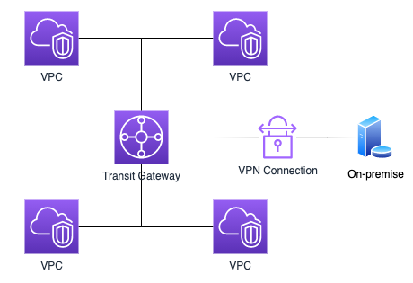

# :book: AWS & CLoud

## :pushpin: NAT Gateway / Transit Gateway 란?

### NAT Gateway

- NAT 게이트웨이는 `NAT(Network Address Translation, 네트워크 주소 변환) 서비스`
- 프라이빗 서브넷의 인스턴스가 VPC 외부의 서비스에 연결할 수 있지만 외부 서비스에서 이러한 인스턴스와 연결을 시작할 수 없도록 NAT 게이트웨이를 사용할 수 있음
- 즉 외부 서비스에서 프라이빗 서브넷의 인스턴스로 접근할 수 없게 하지만 프라이빗 서브넷의 인스턴스에서는 외부 서비스로 접근할 수 있게 해주는 서비스

### VPC (Virtual Private Cloud) 란?

- 먼저 VPC 개념을 알아보면 AWS에는 VPC라는 가상의 사설 네트워크망을 구축할 수 있는 서비스가 있음
- VPC를 이용하면 기존 온프레미스 형태와 마찬가지로 외부에서 접근할 수 없는 사설(Private) 네트워크 망을 구축할 수 있음
- 각각의 VPC에 구축되어 있는 VM 서버들은 기본적으로 통신이 불가
- VPC간 통신을 가능하게 하려면 2가지 방법이 있는데 `VPC Peering`과 `Transit Gateway`가 있음

### VPC Peering 이란?

- VPC 간 연결할 수 있도록 도와주는 서비스
- 프라이빗 IPv4 주소 또는 IPv6 주소를 사용하여 두 VPC 간에 트래픽을 라우팅할 수 있도록 하기 위한 두 VPC 사이의 네트워킹 연결

### Transit Gateway란?

- Transit Gateway는 `VPC Peering`과 마찬가지로 서로 다른 VPC 간에 통신이 가능하게 하는 서비스
- VPC Peering은 1대 1 VPC 연결만 지원하며 직접적으로 연결되어 있지 않은 VPC에 바로 접근할 수 없음
- Transit Gateway는 중앙 허브를 통해 여러 VPC 간 연결 정책을 중앙에서 관리할 수 있고, VPN을 통해 VPC와 온프레미스 네트워크를 연결할 수 있음

### Transit Gateway 특징
- 중앙 허브와 VPN을 통해 VPC와 온프레미스 네트워크를 연결할 수 있음
- 복잡한 피어링 관계를 제거하여 네트워크를 간소화할 수 있음
- 클라우드 라우터 역할을 하므로 새로운 연결을 한번만 추가
- 다른 리전 간의 Transit Gateway와 피어링 연결이 가능

### VPC Peering과의 차이점
- 비용: 같은 조건을 기준으로 Transit Gateway를 사용하는 것이 VPC Peering을 사용하는 것보다 약 1.5배 정도 비쌈
- VPC 개수 제한: VPC Peering의 경우 VPC 당 125개까지 연결이 가능하고 Transit Gateway는 하나당 5000개의 VPC를 연결할 수 있음
- 대역폭: VPC Peering의 경우 대역폭에 제한이 없지만 Transit Gateway는 최대 대역폭이 50Gbps로 제한이 있음

### Reference
- https://yoo11052.tistory.com/170
- https://kim-dragon.tistory.com/178