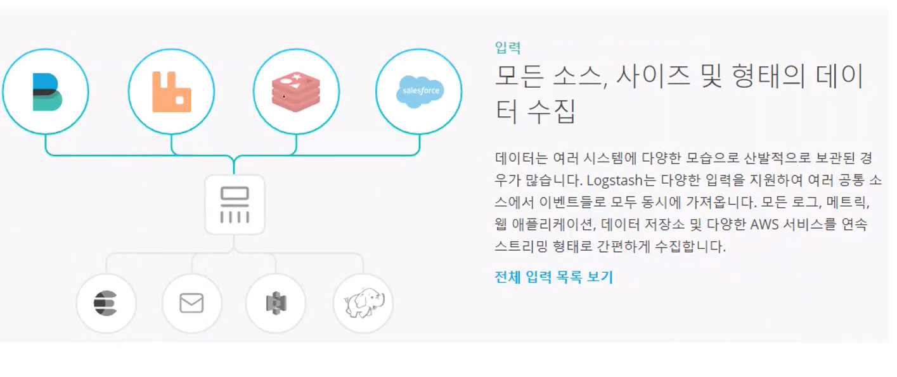

# :book: ElasticSearch

## :pushpin: 로그스태시 / 파일비트 개요

### 로그스태시 개요

- 오픈소스 서버측 데이터 처리로 파이프라인
- 다양한 소스에서 동시에 데이터를 수집하여 변환
- 그 다음 자주 사용하는 엘라스틱 서치에 전달


### 로그스태시의 입력

- https://www.elastic.co/kr/products/logstash




### 로그스태시 필터


### 로그스태시 출력


### 웹로그 자동 수집 Logstash 파이프라인

````
input {
    file {
        codec => json
        path => "c:/logs/*.log"
    }
}
````

```
filter {
    geoip {
        database => "./GeoLite2-City.mmdb"
        source => "ip"
    }
}
```

````
output {
    stdout {
        codec => dots {}
    }
    
    elasticsearch {
        index => "apache_elastic_example"
        template => "./apache_template.json"
        template_name => "apache_elastic_example"
        template_overwrite => true
    }
}
````

### Input: Logstash로 데이터를 가져옴

- file: UNIX 명령 tail -0F와 매우 비슷하게 파일 시스템의 파일에서 읽음
- syslog: RFC3164 형식에 따라 syslog 메시지 및 구문 분석을 위해 잘 알려진 포트 514를 수신
- redis: redis 채널과 redis 목록을 모두 사용하여 redis 서버에서 읽음 
- beat: Filebeat에서 보낸 이벤트를 처리


### Filter: Logstash 파이프라인의 중간 처리 장치

- grok: 임의의 텍스트를 구성. 임의의 텍스트를 구성 현재 구조화되지 않은 로그 데이터를 구문 분석
- mutate: 이벤트 필드에서 일반적인 변환을 수행. 이벤트 및 데이터 수정 및 제거
- drop: 이벤트를 완전히 삭제
- clone: 이벤트를 복사
- geoip: IP 주소의 지리적 위치에 대한 정보를 추가 (kibana의 지도 차트로 사용!)


### output: 최종 단계로 이벤트는 여러 출력 사용 가능

- elasticsearch: Elasticsearch에 데이터 전송. 데이터를 효율적이고 편리하며 쉽게 쿼리 형식으로 저장
- file: 이벤트 데이터를 디스크의 파일로 저장
- graphite: 이벤트 데이터를 Graphite에 전송. 이 데이터는 통계를 저장하고 그래프로 나타내기 위한 널리 사용되는
오픈소스 도구
- statsd: statsd에 이벤트 데이터를 전송. "카운터 및 타이머와 같은 통계를 수신하고 UDP를 통해 전송되며 하나 이상의 플러그 가능한 백엔드 서비스에 집계를 보내는" 서비스


### codec: 코덱은 기본적으로 입력 또는 출력의 일부로 작동할 수 있는 스트림 필터

- json: JSON 형식의 데이터를 인코딩하거나 디코딩
- multiline: 자바 예외 및 스택 추적 메시지와 같은 여러 줄 텍스트 이벤트를 단일 이벤트로 병합


### input: file

- 파일에서 이벤트를 스트리밍
- 파일에 추가되는 내용을 계속 탐지하나 선택적으로 읽어들임
- 파일 입력 예제

````
input {
    file {
        path => "C:/logstash-2.3.1/logstash-tutorial-dataset"
        start_position => "beginning"
        ignore_older => 0
    }
}
````


### input: beats

- 파일비트와 연동하여 사용
- 파일비트를 통해서 로그를 받기 위해 5044 서버를 열어서 대기

````
input {
    beat {
        port => 5044
        host => "0.0.0.0"
    }
}
````


### filter: grok

- 이벤트를 원하는 형식으로 로그로 저장

- 원하는 형식

````
client: 55.3.244.1
method: GET
request: /index.html
bytes: 15824
duration: 0.043 
````

- grok 설정

````
filter {
    grok {
        match => { "message" => "%{IP:client} %{WORD:method} %{URIPATHPARAM:request %{NUMBER:bytes} %{NUMBER:duration}" }
    }
}
````

### filter: geoip

- 이벤트의 일부를 geoip로 활용할 수 있도록 변환

````
geoip {
    source => "[apache2][access][remote_ip]"
    target => "[apache2][access][geoip]"
}
````


### output: elasticsearch

- HTTP 프로토콜만 사용
- hosts: 엘라스틱서치 서버가 어디에 있는지 정의 가능
- manage_template: logstash-%{+YYYY.MM.dd} 인덱스 이름을 정의하고 기본적인 매핑을 지원, 이 사용 옵션 여부를 true, false로 전달(기본값: true)
- index: 사용자가 원하는 형태의 인덱스 이름이 있다면 그 형태를 지정


### 파일 비트

- 일반적인 형식의 로그 데이터들을 수집, 파싱 그리고 시각화를 단일 명령 사용 가능
- 가능한 내부 모듈(Apache, NGNIX, System 및 MySQL)들을 제공
- 시스템의 디폴트 설정을 기반으로 Elasticsearch의 Ingest Node 파이프라인과 Kibana 대시보드를 자동으로 생성

