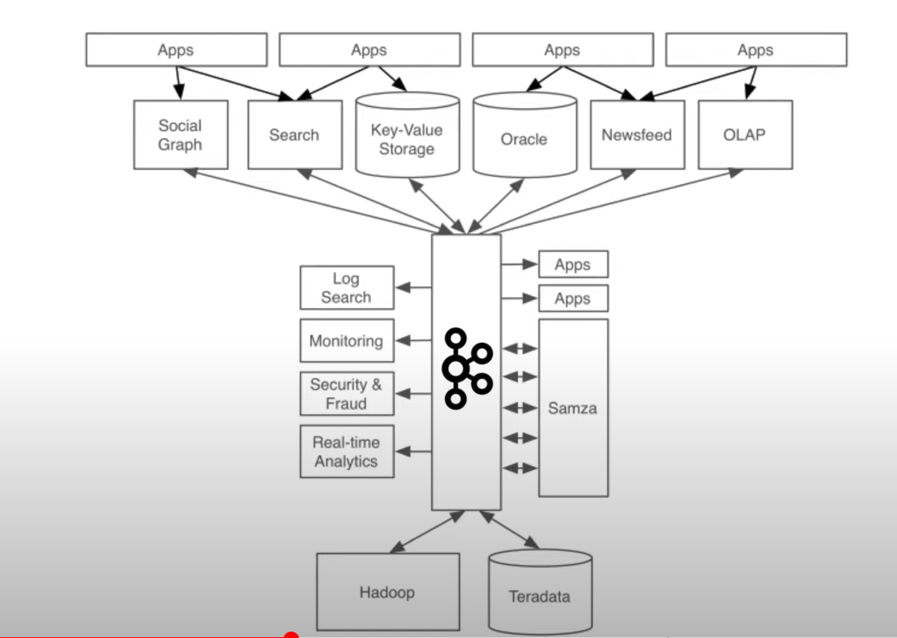

## :pushpin: 아파치 카프카 for beginners

### :seedling: 아파치 카프카 개요 및 설명

### Before Kafka

### After Kafka

### Kafka feature

### Topic
- 카프카에는 다양한 데이터가 들어갈 수 있는데 데이터가 들어가는 공간을 토픽이라고 부름
- 카프카에서는 토픽을 여러개 생성할 수 있음
- 토픽은 데이터베이스의 테이블이나 파일시스템의 폴더와 유사한 성질을 가지고 있다.
- 이 토픽에 프로듀서가 데이터를 넣게되고 컨슈머는 데이터를 가져가게됨
- 토픽은 이름을 가질 수 있는데 목적에 따라 `클릭로그`, `send_sms`, `location_log` 등과 같이 무슨 데이터를 담는지 명확하게 명시하면 추후 유지보수시 편리

### 파티션
- 하나의 토픽은 여러개의 파티션으로 구성될 수 있음
- 첫번째 파티션은 0번부터 시작

#### 파티션이 여러개인 경우
- 프로듀서가 데이터를 보낼 때 키를 지정할 수 있음
  - 키가 `null`이고 기본 파티셔너 사용할 경우 -> 라운드 로빈(Round robin)으로 할당
  - 키가 있고 기본 파티셔너 사용할 경우 -> 키의 해시(hash) 값을 구하고 특정 파티션에 할당
- 주의사항: 파티션을 늘릴 수 있지만 줄일 수는 없음

#### Partition의 record는 언제 삭제되는가?
- log.retention.ms: 최대 record 보존 시간
- log.retention.byte: 최대 record 보존 크기 (byte)