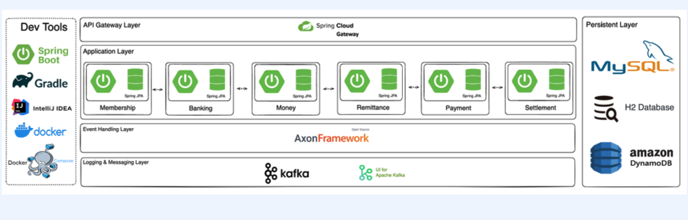

# :book: 간편 결제 프로젝트로 한 번에 끝내는 실전 MSA

## :pushpin: Chapter 01. MSA가 왜 좋은거죠?

### MSA 프로젝트
- 간편결제 프로젝트
- 총 6개의 서비스
  - 머니, 계정, 충전, 송금, 결제, 정산
- Overall Architecture
- 
- Hexagonal Architecture 를 활용한 6개의 기본적인 서비스 기능 구현 그리고 고도화 
- 기술 스택
  - Spring Boot, Java 11, Spring Data JPA, H@, MySQL, Lombok, Gradle, JWT, Axon Framework, Docker, Docker Compose, Kafka, Kafka-ui, Zookeeper, AWS DynamoDB

## 모놀리스의 배경과 종류
### 모놀리스 아키텍처가 무엇인가요?
- **모놀리스 아키텍처 (Monolithic Architecture)**
  - MSA(Micro Service Architecture) 라는 용어가 생기기 전에는 존재조차 하지 않았어요.
  - 기본적으로 모든 종류의 서비스가 하나의 어플리케이션으로 구성되어 있는 아키텍처를 의미해요.
- 특징
  - **하나의 주요 프로세스로 구성**
  - **모든 서비스가 하나의 DB endpoint를 사용**
  - **단 한줄만 코드 수정이 되더라도, 모든 애플리케이션의 재배포가 필요**
  - **싱글 혹은 멀티 모듈로 구성할 수는 있지만 CI의 단위가 달라질 뿐, CD(배포)의 범위는 여전히 전체** 

### 모놀리스 아키텍처가 General 했던 이유
- 모놀리스 아키텍처 (Monolithic Architecture)
- **Easy**
  - 개발하고 빌드(강타입 - 컴파일)하고 그렇게 나온 Output을 서버에서 Run !
- **No Time, No Human Resource**
  - 고려할게 그렇게 많지 않아요.
  - 서버 리소스의 효율적인 활용이 가능해요
- **IDC. Server/DB is very Expensive**
  - IDC가 일반적이었고 굉장히 비싼 자원이었어요.
  - HVAC(항온항습). 관리하는 사람이 항상 필요해요.

### 모놀리스 아키텍처에서 개발/배포의 프로세스
