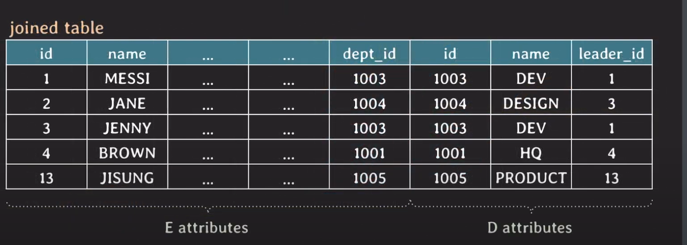
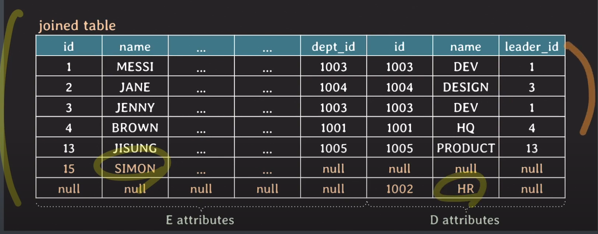

## :pushpin: 인프런 시니어 백엔드 개발자가 알려주는 데이터베이스 개론 & SQL
### :seedling: join
### SQL에게 JOIN 이란?
- 두 개 이상의 table들에 있는 데이터를 한번에 조회하는 것
- 여러 종류의 JOIN이 존재한다
 
### implicit join vs explicit join
ID가 1인 임직원이 속한 부서 이름은?
```mysql
select d.name
from employee as e, department as d 
where e.id = 1 and e.dept_id = d.id;
```
- implicit join: from 절에는 table들만 나열하고 where 절에 join condition을 명시하는 방식
- old-style join syntax
- where 절에 select condition과 join condition이 같이 있기 때문에 가독성이 떨어짐
- 복잡한 join 쿼리를 작성하다 보면 실수로 잘못된 쿼리를 작성할 가능성이 크다.

```mysql
select d.name
from employee as e
join department as d
on e.dept_id = d.id
where e.id = 1;
```
- explicit join: from 절에 `JOIN` 키워드와 함께 joined table들을 명시하는 과정
- from 절에서 `ON` 뒤에 join condition이 명시된다
- 가독성이 좋다
- 복잡한 쿼리 작성 중에도 실수할 가능성이 적다

## inner join vs outer join
### inner join


id가 15인 SIMON과 id가 1002인 HR은 연결되지 않음
```mysql
select *
from employee e inner join department d on e.dept_id = d.id;
```



- result에 SIMON과 HR은 포함되지 않음
- inner join: 두 table에서 join condition을 만족하는 tuple들로 result table을 만드는 join
- FROM table1 `[INNER] JOIN` table2 `ON` join_condition
- join condition에 사용 가능한 연산자: =, <, >, != 등등 여러 비교 연산자가 가능하다
- join condition에서 null 값을 가지는 tuple은 result table에 포함되지 못한다

### outer join
- outer join: 두 table에서 join condition을 만족하지 않는 tuple들도 result table에 포함하는 join
- FROM table1 `LEFT [OUTER] JOIN` table2 `ON` join_condition
- FROM table1 `RIGHT [OUTER] JOIN` table2 `ON` join_condition
- FROM table1 `FULL [OUTER] JOIN` table2 `ON` join_ condition
- join condition에서 사용 가능한 연산자: =, <, >, != 등등 여러 비교 연산자가 가능하다

### LEFT OUTER JOIN

```mysql
select *
from employee e left outer join department d on e.dept_id = d.id;
```


### RIGHT OUTER JOIN

```mysql
select *
from employee e right outer join department d on e.dept_id = d.id;
```


### FULL OUTER JOIN (mysql은 full outer join 지원 x)

```postgresql
select * 
from employee e full outer join department d on e.dept_id = d.id;
```


### equi join
- join condition에서 =(equality comparator)를 사용하는 join
  - inner join outer join 상관없이 =를 사용한 join이라면 equi join으로 보는 경우
  - inner join으로 한정해서 =를 사용한 경우에 equi join으로 보는 경우

### USING
- 두 테이블이 equi join할 때 join하는 attribute의 이름이 같다면 USING으로 간단하게 작성할 수 있다
- 이때 같은 이름의 attribute는 result table에서 한번만 표시된다
- from table1 [inner] join table2 using (attribute(s))
- from table1 left [outer] join table2 using (attribute(s))
- from table1 right [outer] join table2 using (attribute(s))
- from table1 full [outer] join table2 using (attribute(s))

```mysql
select *
from employee e inner join department d using(dept_id);
```

### natural join
- 두 테이블에서 같은 이름을 가지는 모든 attribute pair에 대해서 equi join을 수행
- join condition을 따로 명시하지 않음
- FROM table1 NATURAL [INNER] JOIN table2
- FROM table1 NATURAL LEFT [OUTER] JOIN table2

```mysql
select * 
from employee e natural join department d;
```

### cross join
- 두 테이블의 tuple pair로 만들 수 있는 모든 조합(=Cartesian product)을 result table로 반환한다
- join condition이 없다
- implicit cross join: FROM table1, table2
- explicit cross join: FROM table1 CROSS JOIN table2

```mysql
select * 
from employee cross join department;

select *
from employee, department;
```

### cross join @mysql
- mysql에서는 cross join = inner join = join 이다
- cross join에 on(or using)을 같이 쓰면 inner join으로 동작한다
- inner join (or join)이 on(or using)없이 사용되면 cross join으로 동작한다

### self join
- table이 자기 자신에게 join 하는 경우
