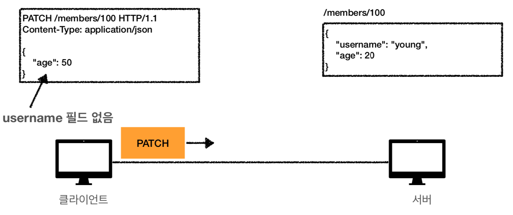

# :book: 모든 개발자를 위한 HTTP 웹 기본 지식

## :pushpin: HTTP 매서드 - PUT, PATCH, DELETE

### PUT
````
PUT /members/100 HTTP/1.1
Content-Type: application.json

{
    "username": "hello",
    "age": 20
}
````

- **리소스를 대체**
  - 리소스가 있으면 대체
  - 리소스가 없으면 생성
  - 쉽게 이야기해서 덮어버림
- **중요! 클라이언트가 리소스를 식별**
  - 클라이언트가 리소스 위치를 알고 URI 지정
  - POST와 차이점

### PUT
- 주의! 리소스를 완전히 대체한다


### PATCH
```
PATCH /members/100 HTTP/1.1
Content-Type: application/json
{
  "age":50
}
```

- 리소스 부분 변경



### DELETE
- 리소스 제거 