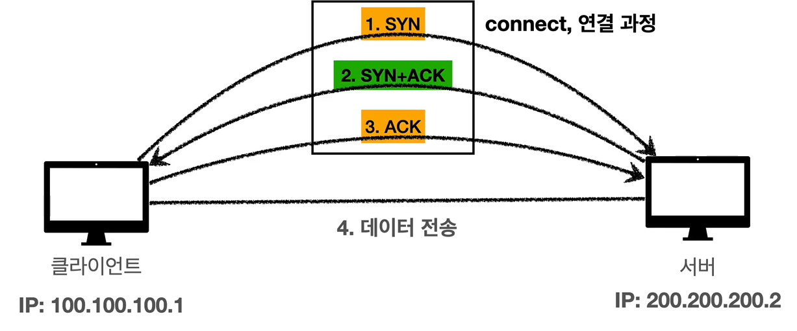

# :book: 모든 개발자를 위한 HTTP 웹 기본 지식

## :pushpin: TCP UDP

### 인터넷 프로토콜 스택의 4계층

- 애플리케이션 계층 - HTTP, FTP
- 전송 계층 - TCP, UDP
- 인터넷 계층 - IP
- 네트워크 인터페이스 계층

### TCP 특징 
> 전송 제어 프로토콜 (Transmission Control Protocol)

- 연결지향 - TCP 3 way handshake (가상 연결)
- 데이터 전달 보증
- 순서 보장
- 신뢰할 수 있는 프로토콜
- 현재는 대부분 TCP 사용

### TCP 3 way handshake

- SYN: 접속 요청
- ACK: 요청 수락
참고: 3. ACK와 함께 데이터 전송 가능