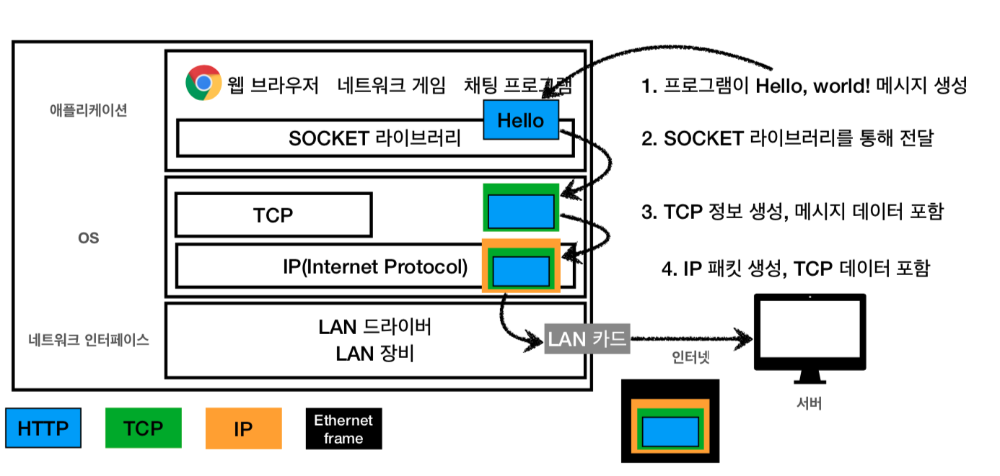
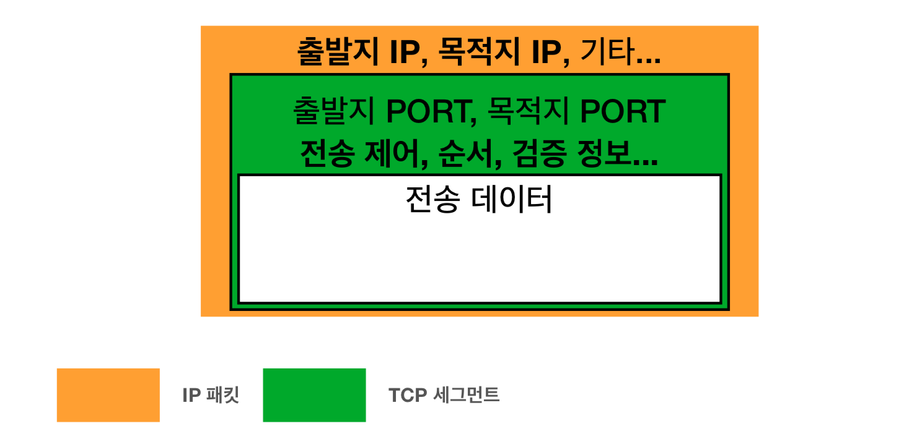

# :book: 모든 개발자를 위한 HTTP 웹 기본 지식

## :pushpin: TCP UDP

### 인터넷 프로토콜 스택의 4계층
- 애플리케이션 계층 - HTTP, FTP
- 전송 계층 - TCP, UDP
- 인터넷 계층 - IP
- 네트워크 인터페이스 계층

### 프로토콜 계층

### TCP 특징 
> 전송 제어 프로토콜 (Transmission Control Protocol)

- 연결지향 - TCP 3 way handshake (가상 연결)
- 데이터 전달 보증
- 순서 보장
- 신뢰할 수 있는 프로토콜
- 현재는 대부분 TCP 사용

### TCP/IP 패킷 정보

### TCP 3 way handshake

- SYN: 접속 요청
- ACK: 요청 수락
참고: 3. ACK와 함께 데이터 전송 가능

### 데이터 전달 보증

### 순서 보장

### UDP 특징
> 사용자 데이터그램 프로토콜(User Datagram Protocol)

- 하얀 도화지에 비유(기능이 거의 없음)
- 연결지향 - TCP 3 way handshake X
- 데이터 전달 보증 X
- 순서 보장 X
- 데이터 전달 및 순서가 보장되지 않지만, 단순하고 빠름
- 정리
  - IP와 거의 같다 + PORT + 체크섬 정도만 추가
  - 애플리케이션에서 추가 작업 필요

### PORT
- 한번에 둘 이상 연결해야하면?

- TCP/IP 패킷정보

### PORT - 같은 IP 내에서 프로세스 구분

### PORT 특징
- 0 ~ 65535 할당 가능
- 0 ~ 1023: 잘 알려진 포트, 사용하지 않는 것이 좋음
  - FTP - 20, 21
  - TELNET - 23
  - HTTP - 80
  - HTTPS - 443

### DNS
- IP는 기억하기 어렵다.
- IP는 변경될 수 있다.

### DNS 도메인 네임 시스템 (Domain Name System)
- 전화번호부
- 도메인 명을 IP 주소로 변환

### DNS 사용

### 인터넷 네트워크 정리
- 인터넷 통신
- IP (Internet Protocol)
- TCP, UDP
- PORT
- DNS 