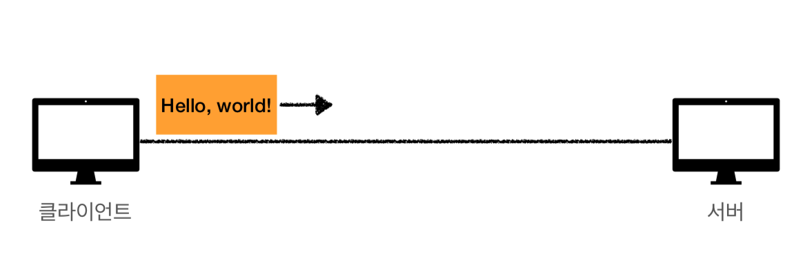
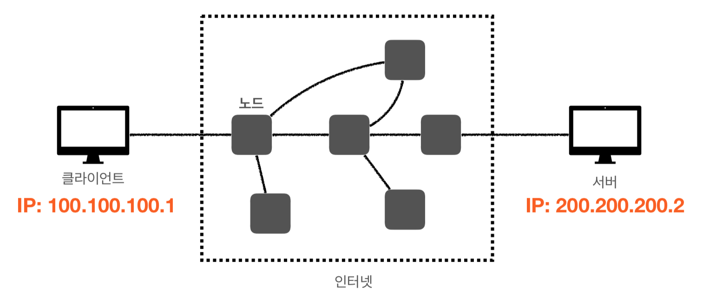
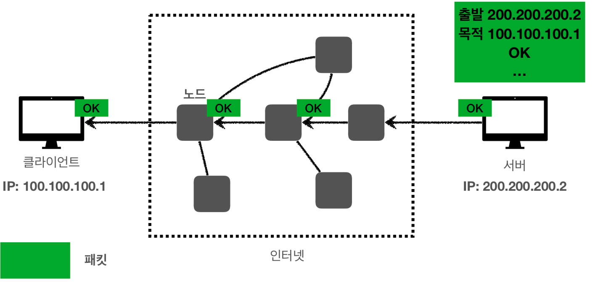

# :book: 모든 개발자를 위한 HTTP 웹 기본 지식

## :pushpin: 모든 개발자를 위한 HTTP 웹 기본 지식 (인프런 - 김영한)

### 인터넷 네트워크
- `인터넷 통신`
- `IP` (Internet Protocol)
- `TCP`, `UDP`
- `PORT`
- `DNS`

### 인터넷에서 컴퓨터 둘은 어떻게 통신할까?

### 복잡한 인터넷 망

## :pushpin: IP (인터넷 프로토콜)

- IP 주소 부여

### IP (인터넷 프로토콜 역할)
- 지정한 IP 주소 (IP Address)에 데이터 전달
- 패킷(Packet)이라는 통신 단위로 데이터 전달

### IP 패킷 정보
- 출발지 IP
- 목적지 IP
- 기타...
- 전송 데이터

### 클라이언트 패킷 전달 

### 서버 패킷 전달

### IP 프로토콜의 한계
- 비연결성
  - 패킷을 받을 대상이 없거나 서비스 불능 상태여도 패킷 전송
- 비신뢰성
  - 중간에 패킷이 사라지면?
  - 패킷이 순서대로 안오면?
- 프로그램 구분
  - 같은 IP를 사용하는 서버에서 통신하는 애플리케이션이 둘 이상이면?