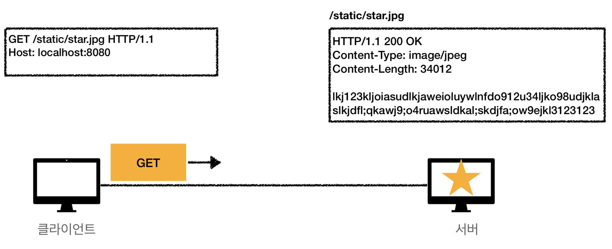
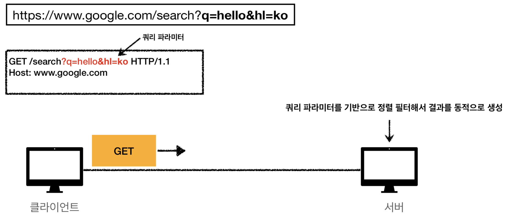

# :book: 모든 개발자를 위한 HTTP 웹 기본 지식

## :pushpin: HTTP 메서드 활용

- 클라이언트에서 서버로 데이터 전송
- HTTP API 설계 예시

### 클라이언트에서 서버로 데이터 전송

#### 데이터 전달 방식은 크게 2가지
- 쿼리 파라미터를 통한 데이터 전송
  - GET
  - 주로 정렬 필터 (검색어)
- 메시지 바디를 통한 데이터 전송
  - POST, PUT, PATCH
  - 회원 가입, 상품 주문, 리소스 등록, 리소스 변경

### 클라이언트에서 서버로 데이터 전송 (4가지 상황)
- 정적 데이터 조회
  - 이미지, 정적 텍스트 문서
- 동적 데이터 조회
  - 주로 검색, 게시판 목록에서 정렬 필터 (검색어)
- HTML Form을 통한 데이터 전송
  - 회원 가입, 상품 주문, 데이터 변경
- HTTP API를 통한 데이터 전송
  - 회원 가입, 상품 주문, 데이터 변경
  - 서버 to 서버, 앱 클라이언트, 웹 클라이언트 (Ajax)

### 정적 데이터 조회 (쿼리 파라미터 미사용)

- 이미지, 정적 텍스트 문서
- 조회는 GET을 사용
- 정적 데이터는 일반적으로 쿼리 파라미터 없이 리소스 경로로 단순하게 조회 가능

### 동적 데이터 조회 (쿼리 파라미터 사용)

- 주로 검색, 게시판 목록에서 정렬 필터 (검색어)
- 조회 조건을 줄여주는 필터, 조회 결과를 정렬하는 정렬 조건에 주로 사용
- 조회는 GET 사용
- GET은 쿼리 파라미터 사용해서 데이터 전달