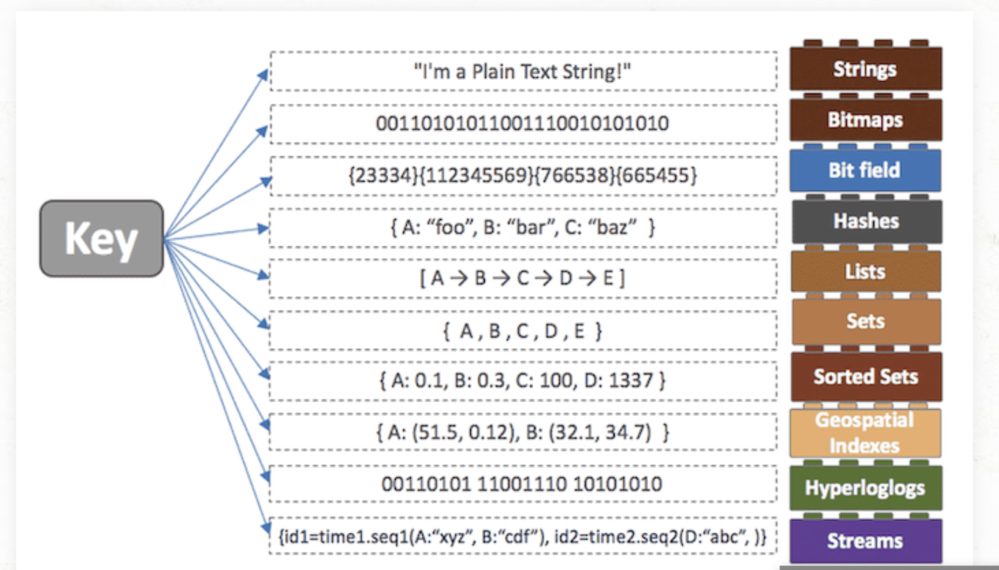

# :book: selab-study
## :pushpin: Topic. Redis

### Redis란
- Redis는 `고성능 키-값 저장소`로서 String, list, hash, set, sorted set 등의 자료구조를 지원하는 `NoSQL` 이다.

### Redis는 언제 사용하는가
- `DB`, `Cache`, `Message Queue`, `Shared Memory` 용도로 사용될 수 있음
- 주로 Cache 서버를 구현할 때 많이 사용함

### Redis의 특징
- 영속성을 지원하는 `인 메모리 데이터 저장소`
- `다양한 자료구조`를 지원함
- `싱글 스레드` 방식으로 인해 연산을 원자적으로 수행이 가능
- 읽기 성능 증대를 위한 서버 측 `리플리케이션` 지원
- 쓰기 성능 증대를 위한 클라이언트 측 `샤딩` 지원
- 다양한 서비스에서 사용되며 검증된 기술

### Redis의 컬렉션

- `Redis`는 `데이터`를 `메모리에 저장`하여 빠른 DB
- Memcached처럼 단순한 Key-Value 쌍이 아니고 다양한 데이터 구조체를 지원함. 이를 `컬렉션`이라고 부름
- 위 그림을 보면 Key가 될 수 있는 데이터 구조체가 다양함
- 이렇게 다양한 자료 구조를 지원하게 되면 개발의 편의성이 좋아진다는 장점이 있음

### Redis는 왜 속도가 빠른가?
- `Key-Value` 방식이므로 `쿼리`를 날리지 않고 결과를 얻을 수 있음

### Redis는 영속성을 어떻게 보장하는가?
- RDB 또는 AOF 방식을 통해 영속성을 보장
- `RDB(Snapshotting)` 방식
  - 순간적으로 메모리에 있는 내용 전체를 디스크에 옮겨 담는 방식
- `AOF (Append On File)` 방식
  - Redis의 모든 write/update 연산 자체를 모두 log 파일에 기록하는 형태