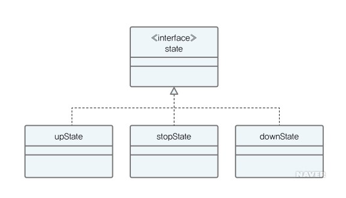

# :book: selab-study
## :pushpin: Topic. 상태 패턴 (State Pattern)


### 1. 스테이트 패턴 (State Pattern)

> 객체가 상태에 따라 행위를 다르게 할 때, 직접 상태를 체크하여 상태에 따른 행위를 호출하는 것이 아니라
> 상태를 객체화하여 필요에 따라 다르게 행동하도록 위임하는 디자인 패턴

- 객체의 특정 상태 = 클래스
- 상태에 따른 행위 = 클래스 내 메서드
- 상태 클래스를 인터페이스로 캡슐화 
- 엘리베이터 예제




### 2. 사용 이유

- 엘리버에티는 올라가는 상태(UP), 내려가는 상태(DOWN), 정지 상태(STOP)가 존재

```java
public class Elevator {
    public static final String up = "UP";
    public static final String down = "DOWN";
    public static final String stop = "STOP";
    private String curState = "";
    
    public Elevator() {
        this.curState = stop;
    }
}
```


