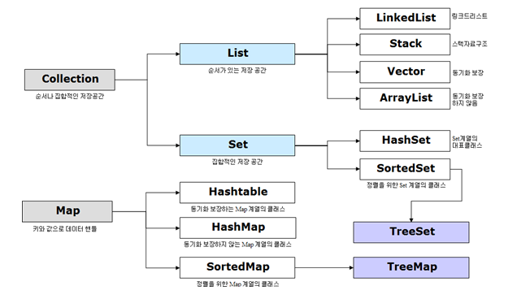

# :book: selab-study
## :pushpin: Topic. Java 컬렉션 (Collection)

### Collection이란?

- 자바에서 컬렉션(collection)이란 다수의 데이터를 쉽고 효율적으로 처리할 수 있는 표준화된 방법을 제공하는 클래스의 집합을 의미
- 즉 데이터를 저장하는 자료 구조와 데이터를 처리하는 알고리즘을 구조화하여 클래스로 구현해 놓은 것
- 컬렉션 프레임워크는 자바의 인터페이스(interface)를 사용하여 구현함

### Java 컬렉션 프레임워크 상속 구조

- Collection  인터페이스는 List, Set, Queue로 크게 3가지 상위 인터페이스로 분류할 수 있음
- Map의 경우 Collection 인터페이스를 상속받고 있지는 않지만 Collection으로 분류됨

### Collection 인터페이스의 특징

|인터페이스|구현 클래스|특징|
|----------|----------|----------|
|Set|HashSet, TreeSet|순서를 유지하지 않는 데이터의 집합으로 데이터의 중복을 허용하지 않음|
|List|LinkedList, Vector, ArrayList|순서가 있는 데이터의 집합으로 데이터의 중복을 허용함|
|Map|HashTable,HashMap,TreeMap|키(Key),값(Value)의 쌍으로 이루어진 데이터의 집합으로 순서는 유지되지 않으며 키의 중복을 허용하지 않으나 값의 중복은 허용함|

