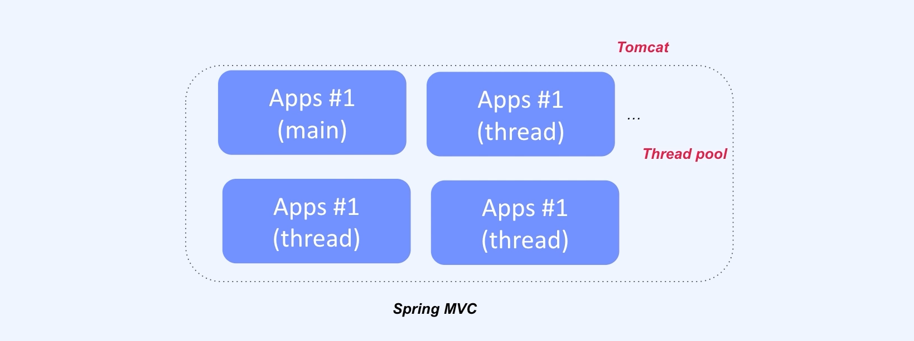

## :pushpin: Spring Webflux
### Spring Webflux
- Reactive Stream API non-block, asynchronous
  - 마이크로서비스 GW
  - WebSocket
  - 실시간 채팅 서비스

### CPU Bound vs I/O Bound
#### CPU Bound

- Context Switching

#### CPU
- `Register`
- `ALU`

#### Multi Core

#### I/O Bound
- `Input` / `Output`

