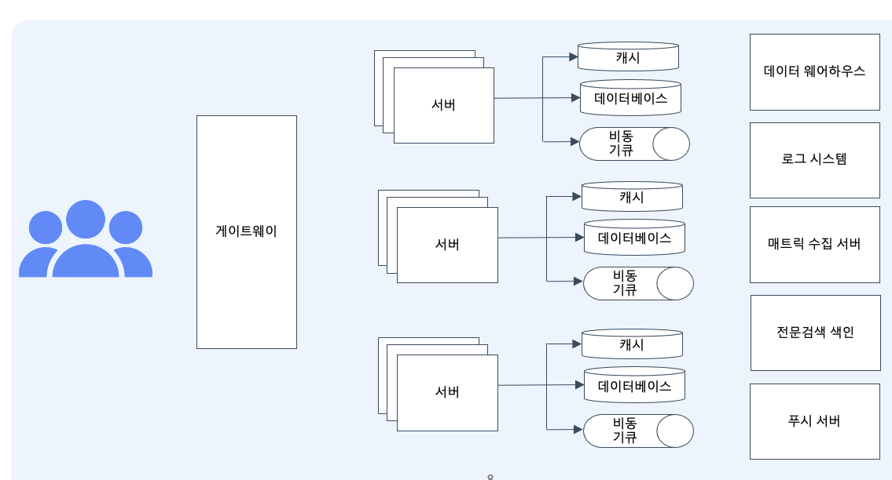

# :book: 백엔드 개발자를 위한 한 번에 끝내는 대용량 데이터 & 트래픽 처리 
## :pushpin: 대용량 시스템에 대한 이해 
### 웹의 기본 아키텍처
- 웹의 기본 아키텍처
  - 클라이언트 
  - 서버
  - 데이터베이스

- 웹의 요구 사항이 점점 복잡해짐
  - 클라이언트
  - 웹 서버
  - 웹 애플리케이션 서버
  - 데이터베이스

### 웹 서버, 웹 애플리케이션 서버는 왜 나누어져 있을까?
- 태초에는 웹서버만 있는 형태에서 웹의 복잡도가 증가함에 따라...
- 관심사의 분리 / 관측 가능한 시스템 / 효율적인 리소스 사용

### 대용량 시스템의 모습
