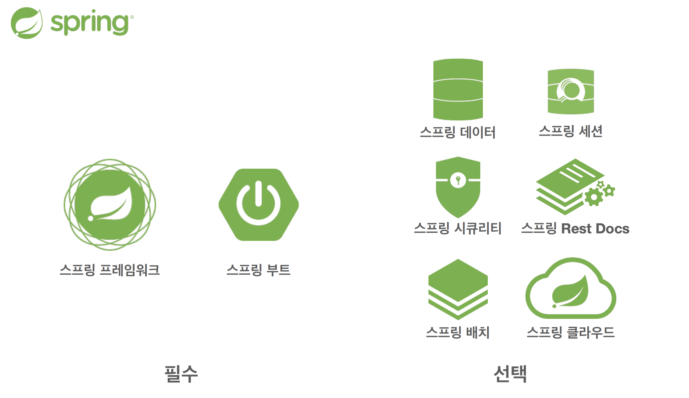

# :book: 스프링 핵심 원리

## :pushpin: 1. 객체 지향 설계와 스프링

### 자바 진영의 추운 겨울과 스프링의 탄생
- 자바당 정파 기술 EJB (Enterprise Java Beans)

### 스프링
- EJB 컨테이너 대체
- 단순함의 승리
- 현재 사실상 표준 기술

### 스프링 생태계

### 스프핑 프레임워크
- 핵심 기술: 스프링 DI 컨테이너, AOP, 이벤트, 기타
- 웹 기술: 스프링 MVC, 스프링 WebFlux
- 데이터 접근 기술: 트랜잭션, JDBC, ORM 지원, XML 지원
- 기술 통합: 캐시, 이메일, 원격접근, 스케줄링
- 테스트: 스프링 기반 테스트 지원 
- 언어: 코틀린, 그루비
- 최근에는 스프링 부트를 통해서 스프링 프레임워크의 기술들을 편리하게 사용

### 스프링 부트
- 스프링을 편리하게 사용할 수 있도록 지원, 최근에는 기본으로 사용
- 단독으로 실행할 수 있는 스프링 애플리케이션을 쉽게 생성
- Tomcat 같은 웹 서버를 내장해서 별도의 웹 서버를 설치하지 않아도 됨
- 손쉬운 빌드 구성을 위한 starter 종속성 제공
- 스프링과 3rd parth(외부) 라이브러리 자동 구성
- 메트릭, 상태 확인, 외부 구성 같은 프로덕션 준비 기능 제공
- 관례에 의한 간결한 설정

