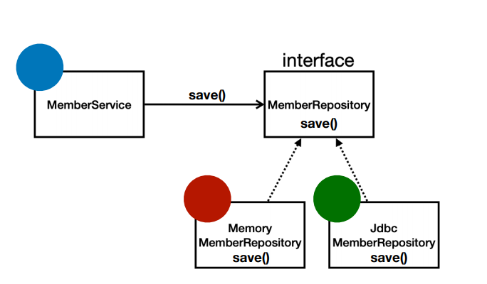

# :book: 스프링 핵심 원리

## :pushpin: 좋은 객체 지향 프로그래밍이란?

### 객체 지향 특징

1. 추상화
2. 캡슐화 
3. 상속
4. 다형성

### 객체 지향 프로그래밍

- 객체 지향 프로그래밍은 컴퓨터 프로그램을 명령어의 목록으로 보는 시각에서 벗어나 여러개의 독립된 단위,
즉 **"객체"**들의 모임으로 파악하고자 하는 것이다. 각각의 객체는 메시지를 주고받고, 데이터를 처리할 수 있다. (협력)

- 객체 지향 프로그래밍은 프로그램을 유연하고 변경이 용이하게 만들기 때문에 대규모 소프트웨어 개발에 많이 사용된다.

### 유연하고 변경이 용이?

- 레고 블럭 조립하듯이
- 키보드, 마우스 갈아 끼우듯이
- 컴퓨터 부품 갈아 끼우듯이
- 컴포넌트를 쉽고 유연하게 변경하면서 개발할 수 있는 방법

### 다형성 (Polymorphism)

- 실세계와 객체 지향을 1:1로 매칭 X
- 그래도 실세계의 비유로 이해하기에는 좋음
- 역할과 구현으로 세상을 구분

### 다형성의 실세계 비유 (예시)

- 운전자 - 자동차
- 공연 무대
- 키보드, 마우스, 세상의 표준 인터페이스들
- 정렬 알고리즘
- 할인 정책 로직

### 역할과 구현을 분리

- 역할과 구현으로 구분하면 세상이 단순해지고, 유연해지며 변경도 편리해진다.
- 장점
    - 클라이언트는 대상의 역할(인터페이스)만 알면 된다.
    - 클라이언트는 구현 대상의 내부 구조를 몰라도 된다.
    - 클라이언트는 구현 대상의 내부 구조가 변경되어도 영향을 받지 않는다.
    - 클라이언트는 구현 대상 자체를 변경해도 영향을 받지 않는다. 
    

### 역할과 구현을 분리 (자바 언어)

- 자바 언어의 다형성을 활용
    - 역할 = 인터페이스
    - 구현 = 인터페이스를 구현한 클래스, 구현 객체
    
- 객체를 설계할 때 역할과 구현을 명확히 분리
- 객체 설계시 역할(인터페이스)을 먼저 부여하고, 그 역할을 수행하는 구현 객체 만들기

### 객체의 협력이라는 관계부터 생각

- 혼자 있는 객체는 없다.
- 클라이언트: 요청, 서버: 응답
- 수많은 객체 클라이언트와 객체 서버는 서로 협력 관계를 가진다.

### 자바 언어의 다형성

- 오버라이딩을 떠올려보자
- 오버라이딩은 자바 기본 문법
- 오버라이딩된 메서드가 실행
- 다형성으로 인터페이스를 구현한 객체를 실행 시점에 유연하게 변경할 수 있다.
- 물론 클래스 상속 관계도 다형성, 오버라이딩 적용 가능

### 다형성의 본질

- 인터페이스를 구현한 객체 인스턴스를 실행 시점에 유연하게 변경할 수 있다.
- 다형성의 본질을 이해하려면 **협력**이라는 객체 사이의 관계에서 시작해야함
- 클라이언트를 변경하지 않고, 서버의 구현 기능을 유연하게 변경할 수 있다.

### 역할과 구현을 분리 (정리)

- 실세계의 역할과 구현이라는 편리한 컨셉을 다형성을 통해 객체 세상으로 가져올 수 있음
- 유연하고 변경이 용이
- 확장 가능한 설계
- 클라이언트에 영향을 주지 않는 변경 가능
- 인터페이스를 안정적으로 잘 설계하는 것이 중요

### 역할과 구현을 분리 (한계)

- 역할(인터페이스) 자체가 변하면, 클라이언트, 서버 모두에 큰 변경이 발생한다.
- 자동차를 비행기로 변경해야 한다면?
- 대본 자체가 변경된다면?
- USB 인터페이스가 변경된다면?
- 인터페이스를 안정적으로 잘 설계하는 것이 중요

### 스프링과 객체 지향
- 다형성이 가장 중요하다!
- 스프링은 다형성을 극대화해서 이용할 수 있게 도와준다.
- 스프링에서 이야기하는 제어의 역전(IoC), 의존관계 주입(DI)은 다형성을 활용해서 역할과 구현을 편리하게 다룰 수 있도록 지원한다.
- 스프링을 사용하면 마치 레고 블럭 조립하듯이! 공연 무대의 배우를 선택하듯이! 구현을 편리하게 변경할 수 있다. 

### 좋은 객체 지향 설계의 5가지 원칙 (SOLID)

- SOLID: 클린코드로 유명한 로버트 마인티 좋은 객체 지향 설계의 5가지 원칙을 정리
  - SRP: 단일 책임 원칙(single responsibility principle)
  - OCP: 개방-폐쇄 원칙 (Open/closed principle)
  - LSP: 리스코프 치환 원칙 (Liskov substitution principle)
  - ISP: 인터페이스 분리 원칙 (Interface segregation principle)
  - DIP: 의존관계 역전 원칙 (Depencency inversion principle)
  

### SRP 단일 책임 원칙 (Single responsibility principle)

- **한 클래스는 하나의 책임만 가져야 한다.**
- 하나의 책임이라는 것은 모호하다.
  - 클 수 있고, 작을 수 있다.
  - 문맥과 상황에 따라 다르다.
  
- **중요한 기준은 변경**이다. 변경이 있을 때 파급 효과가 적으면 단일 책임 원칙을 잘 따른 것
- 예) UI 변경, 객체의 생성과 사용을 분리

### OCP 개방-폐쇄 원칙 (Open/closed principle)

- 소프트웨어 요소는 확장에는 열려 있으나 변경에는 닫혀 있어야 한다
- 이런 거짓말같은 말이? 확장을 하려면, 당연히 기존 코드를 변경
- 다형성을 활용해보자
- 인터페이스를 구현한 새로운 클래스를 하나 만들어서 새로운 기능을 구현
- 지금까지 배운 역할과 구현의 분리를 생각해보자

