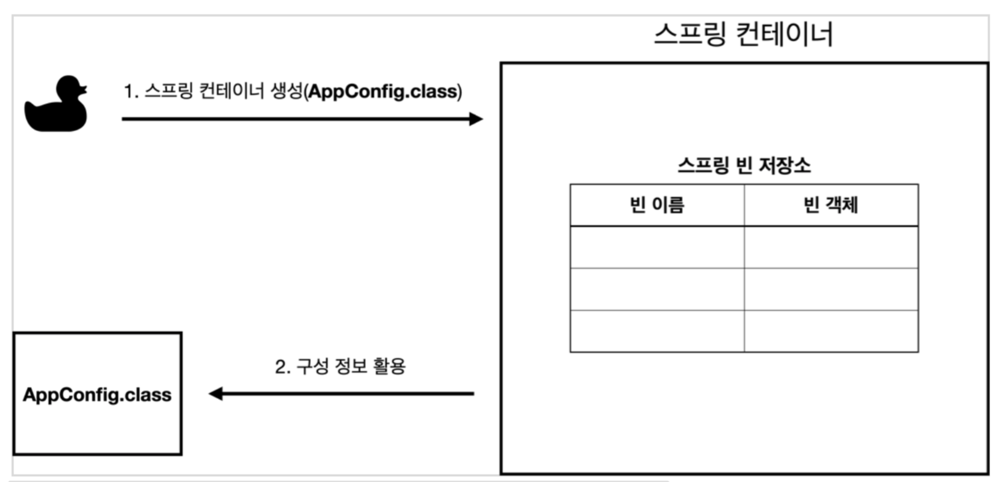
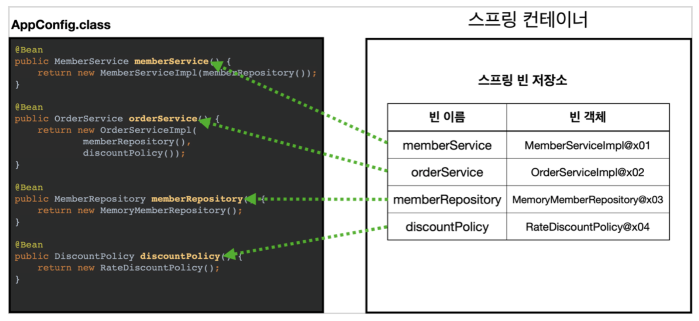
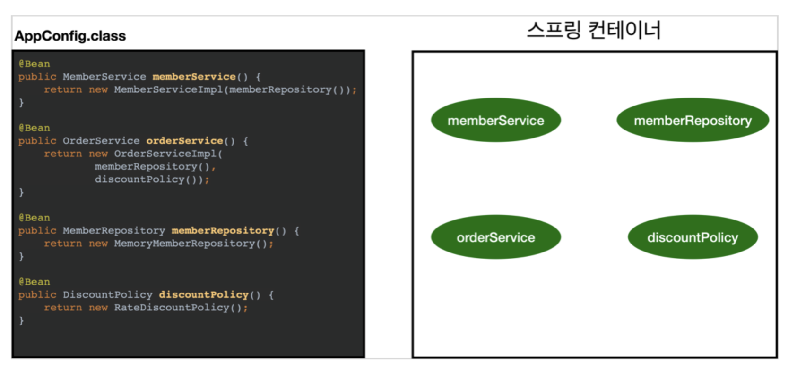

# :book: 스프링 핵심 원리

## :pushpin: 스프링 컨테이너와 스프링 빈

### 스프링 컨테이너 생성

```
// 스프링 컨테이너 생성
ApplicationContext applicationContext =
                        new AnnotationConfigApplicationContext(AppConfig.class);
```

- `ApplicationContext`를 스프링 컨테이너라 한다.
- `ApplicationContext`는 인터페이스이다.
- 스프링 컨테이너는 XML을 기반으로 만들 수 있고, 애노테이션 기반의 자바 설정 클래스로 만들 수 있다.
- 직전에 AppConfig를 사용했던 방식이 애노테이션 기반의 자바 설정 클래스로 컨테이너를 만든 것이다.
- 자바 설정 클래스를 기반으로 스프링 컨테이너(ApplicationContext)를 만들어보자.
    - new AnnotationCOnfigApplicationContext(AppConfig.class);
    - 이 클래스는 ApplicationContext 인터페이스의 구현체이다.
    
> 참고: 더 정확히는 스프링 컨테이너를 부를 때 BeanFactory, ApplicationContext로 구분해서 
> 이야기한다. BeanFactory를 직접 사용하는 경우는 거의 없으므로 일반적으로 ApplicationContext를
> 스프링 컨테이너라 한다.


### 스프링 컨테이너의 생성 과정

1. 스프링 컨테이너 생성



- new AnnotationConfigApplicationContext(AppConfig.class)
- 스프링 컨테이너를 생성할 때는 구성 정보를 지정해주어야 한다.
- 여기서는 AppConfig.class를 구성 정보로 지정했다.

2. 스프링 빈 등록
- 스프링 컨테이너는 파라미터로 넘어온 설정 클래스 정보를 사용해서 스프링 빈을 등록한다.
  - 빈 이름
    - 빈 이름은 메서드 이름을 사용한다.
    - 빈 이름을 직접 부여할 수도 있다.
    - @Bean(name="memberService2")
  
- 주의: 빈 이름은 항상 다른 이름을 부여해야 한다. 같은 이름을 부여하면, 다른 빈이 무시되거나 기존 빈을 덮어버리거나 설정에 따라 오류가 발생한다.

  
  
3. 스프링 빈 의존관계 설정 - 준비
   
4. 스프링 빈 의존관계 설정 - 완료

   
- 스프링 컨테이너는 설정 정보를 참고해서 의존관계를 주입(DI)한다.

> 참고: 스프링은 빈을 생성하고, 의존관계를 주입하는 단계가 나누어져 있다. 그런데 이렇게 자바 코드로 스프링 빈을
> 호출하면서 의존관계 주입도 한번에 처리된다.


### 정리
- 스프링 컨테이너를 생성하고, 설정(구성) 정보를 참고해서 스프링 빈도 등록하고 의존관계도 설정했다.
이제 스프링 컨테이너에서 데이터를 조회해보자.
  
````
class ApplicationContextInfoTest {

    AnnotationConfigApplicationContext ac = new AnnotationConfigApplicationContext(AppConfig.class);

    @Test
    @DisplayName("모든 빈 출력하기")
    void findAllBean() {
        String[] beanDefinitionNames = ac.getBeanDefinitionNames();
        for (String beanDefinitionName : beanDefinitionNames) {
            Object bean = ac.getBean(beanDefinitionName);
            System.out.println("name = " + beanDefinitionName + " object = " + bean);
        }
    }

    @Test
    @DisplayName("애플리케이션 빈 출력하기")
    void findApplicationBean() {
        String[] beanDefinitionNames = ac.getBeanDefinitionNames();
        for (String beanDefinitionName : beanDefinitionNames) {
            BeanDefinition beanDefinition = ac.getBeanDefinition(beanDefinitionName);

            // Role ROLE_APPLICATION: 직접 등록한 애플리케이션 빈
            // Role ROLE_INFRASTRUCTURE: 스프링이 내부에서 사용하는 빈
            if (beanDefinition.getRole() == BeanDefinition.ROLE_APPLICATION) {
                Object bean = ac.getBean(beanDefinitionName);
                System.out.println("name = " + beanDefinitionName + " object = " + bean);
            }
        }
    }
}
````

- 모든 빈 출력하기
- ac.getBeanDefinitionNames(): 스프링에 등록된 모든 빈 이름을 조회한다.
- ac.getBean(): 빈 이름으로 빈 객체(인스턴스)를 조회한다.


### 스프링 빈 조회 - 기본
- 스프링 컨테이너에서 스프링 빈을 찾는 가장 기본적인 조회 방법
  - `ac.getBean(빈이름, 타입)`
  - `ac.getBean(타입)`
  - 조회 대상 스프링 빈이 없으면 예외 발생
    - `NoSuchBeanDefinitionException: No bean named 'xxxxx' available`
