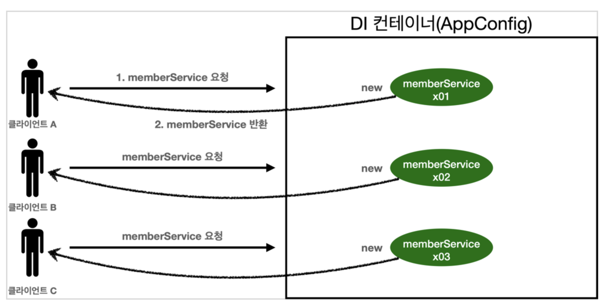
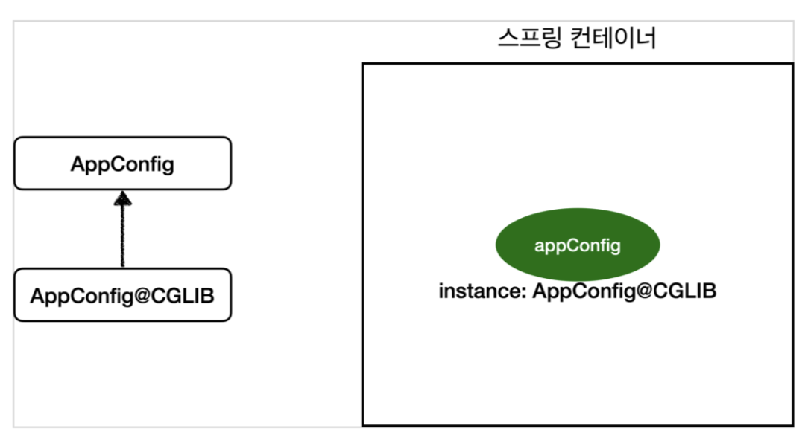

# :book: 스프링 핵심 원리

## :pushpin: 싱글톤 컨테이너

### 웹 애플리케이션과 싱글톤
- 스프링은 태생이 기업용 온라인 서비스 기술을 지원하기 위해 탄생했다.
- 대부분의 스프링 애플리케이션은 웹 애플리케이션이다. 물론 웹이 아닌 애플리케이션 개발도 얼마든지 개발할 수 있다.
- 웹 애플리케이션은 보통 여러 고객이 동시에 요청을 한다.



- 우리가 만들었던 스프링 없는 순수한 DI 컨테이너인 AppConfig는 요청을 할 때마다 객체를 새로 생성한다.
- 고객 트래픽이 초당 100이 나오면 초당 100개 객체가 생성되고 소멸된다! -> 메모리 낭비가 심하다.
- 해결방안은 해당 객체가 딱 1개만 생성되고, 공유하도록 설계하면 된다. -> 싱글톤 패턴


### 싱글톤 패턴
- 클래스의 인스턴스가 딱 1개만 생성되는 것을 보장하는 디자인 패턴이다.
- 그래서 객체 인스턴스를 2개 이상 생성하지 못하도록 막아야 한다.
    - private 생성자를 사용해서 외부에서 임의로 new 키워드를 사용하지 못하도록 막아야 한다.
  

```
public class SingletonService {
  
  // 1. static 영역에 객체를 딱 1개만 생성해둔다.
  private static final SingletonService instance = new SingletonService();
  
  // 2. public 으로 열어서 객체 인스턴스가 필요하면 이 static 메서드를 통해서만 조회하도록 허용한다.
  public static SingletonService getInstance() {
    return instance;
  }
  
  // 3. 생성자를 private 으로 선언해서 외부에서 new 키워드를 사용한 객체 생성을 못하게 막는다.
  private SingletonSerivce() {
  }
  
  public void logic() {
    System.out.println("싱글톤 객체 로직 호출");
  }
}
```

1. static 영역에 객체 instance를 미리 하나 생성해서 올려둔다.
2. 이 객체 인스턴스가 필요하면 오직 getInstance() 메서드를 통해서만 조회할 수 있다. 이 메서드를 호출하면 항상
같은 인스턴스를 반환한다.
3. 딱 1개의 객체 인스턴스만 존재해야 하므로, 생성자를 private으로 막아서 혹시라도 외부에서 new 키워드로 객체 인스턴스가 생성되는 것을 막는다.

- private으로 new 키워드를 막아두었다.
- 호출할 때마다 같은 객체 인스턴스를 반환하는 것을 확인할 수 있다.

> 참고: 싱글톤 패턴을 구현하는 방법은 여러가지가 있다. 여기서는 객체를 미리 생성해두는 가장 단순하고 안전한 방법을 선택했다.

> 싱글톤 패턴을 적용하면 고객의 요청이 올 때마다 객체를 생성하는 것이 아니라, 이미 만들어진 객체를 공유해서
> 효율적으로 사용할 수 있다. 하지만 싱글톤 패턴은 다음과 같은 수많은 문제점들을 가지고 있다.

### 싱글톤 패턴 문제점
- 싱글톤 패턴을 구현하는 코드 자체가 많이 들어간다.
- 의존관게상 클라이언트가 구체 클래스에 의존한다. -> DIP를 위반한다.
- 클라이언트가 구체 클래스에 의존해서 OCP 원칙을 위반할 가능성이 높다.
- 테스트하기 어렵다.
- 내부 속성을 변경하거나 초기화 하기 어렵다.
- private 생성자로 자식 클래스를 만들기 어렵다.
- 결론적으로 유연성이 떨어진다.
- 안티패턴으로 불리기도 한다.


### 싱글톤 컨테이너
- 스프링 컨테이너는 싱글톤 패턴의 문제점을 해결하면서, 객체 인스턴스를 싱글톤(1개만 생성)으로 관리한다.
스프링 빈이 바로 싱글톤으로 관리되는 빈이다.
  
- 싱글톤 컨테이너
  - 스프링 컨테이너는 싱글턴 패턴을 적용하지 않아도, 객체 인스턴스를 싱글톤으로 관리한다.
  - 컨테이너는 객체를 하나만 생성해서 관리한다.
  - 스프링 컨테이너는 싱글톤 컨테이너 역할을 한다. 이렇게 싱글톤 객체를 생성하고 관리하는 기능을 싱글톤 레지스트리라 한다.
  - 스프링 컨테이너의 이런 기능 덕분에 싱글턴 패턴의 모든 단점을 해결하면서 객체를 싱글톤으로 유지할 수 있다.
    - 싱글톤 패턴을 위한 지저분한 코드가 들어가지 않아도 된다.
    - DIP, OCP, 테스트, private 생성자로부터 자유롭게 싱글톤을 사용할 수 있다.
  


- 스프링 컨테이너 덕분에 고객의 요청이 올 때마다 객체를 생성하는 것이 아니라, 이미 만들어진 객체를 공유해서 효율적으로 재사용할 수 있다.

> 참고: 스프링의 기본 빈 등록 방식은 싱글톤이지만, 싱글톤 방식만 지원하는 것은 아니다. 요청할 때마다 새로운 객체를 생성해서 
> 반환하는 기능도 제공한다. 


### 싱글톤 방식의 주의점
- 싱글톤 패턴이든, 스프링 같은 싱글톤 컨테이너를 사용하든, 객체 인스턴스를 하나만 생성해서 공유하는 싱글톤 방식은 
  여러 클라이언트가 하나의 같은 객체 인스턴스를 공유하기 때문에 싱글톤 객체는 상태를 유지(stateful)하게 설계하면 안된다.
- 무상태(stateless)로 설계해야 한다!
  - 특정 클라이언트에 의존적인 필드가 있으면 안된다.
  - 특정 클라이언트가 값을 변경할 수 있는 필드가 있으면 안된다!
  - 가급적 읽기만 가능해야 한다.
  - 필드 대신에 자바에서 공유되지 않는, 지역변수, 파라미터, ThreadLocal 등을 사용해야 한다.
- 스프링 빈의 필드에 공유 값을 설정하면 정말 큰 장애가 발생할 수 있다.


```
public class StatefulServiceTest {

    @Test
    void statefulServiceSingleton() {
        ApplicationContext ac = new AnnotationConfigApplicationContext(TestConfig.class);
        StatefulService statefulService1 = ac.getBean(StatefulService.class);
        StatefulService statefulService2 = ac.getBean(StatefulService.class);

        //ThreadA: A사용자 10000원 주문
        statefulService1.order("userA", 10000);

        //ThreadB: B사용자 20000원 주문
        statefulService2.order("userB", 20000);

        //ThreadA: 사용자A 주문 굼액 조회
        int price = statefulService1.getPrice();
        System.out.println("price = " + price);

        Assertions.assertThat(statefulService1.getPrice()).isEqualTo(20000);
    }

    static class TestConfig {

        @Bean
        public StatefulService statefulService() {
            return new StatefulService();
        }
    }
}
```

- ThreadA가 사용자 A 코드를 호출하고 ThreadB가 사용자 B 코드를 호출한다 가정하자.
- StatefulService의 price 필드는 공유되는 필드인데, 특정 클라이언트가 값을 변경한다.
- 사용자 A의 주문금액은 10000원이 되어야 하는데, 20000원이라는 결과가 나왔다.
- 진짜 공유 필드는 조심해야 한다! 스프링 빈은 항상 무상태(stateless)로 설계하자.

```
public class StatefulService {
//    private int price;  // 상태를 유지하는 필드

    public int order(String name, int price) {
        System.out.println("name = " + name + " price = " + price);
//        this.price = price; // 여기가 문제!
        return price;
    }
}
```


### @Configuration과 싱글톤 

### @Configuration과 바이트코드 조작의 마법
- 스프링 컨테이너는 싱글톤 레지스트리다. 따라서 스프링 빈이 싱글톤이 되도록 보장해주어야 한다.
- 그런데 스프링이 자바 코드까지 어떻게 하기는 어렵다.
- 그래서 스프링은 클래스의 바이트코드를 조작하는 라이브러리를 사용한다.

- 순수한 클래스라면 다음과 같이 출력되어야 한다.
- class hello.core.AppConfig

- 그런데 예상과는 다르게 클래스 명에 xxxCGLIB가 붙으면서 상당히 복잡해진 것을 볼 수 있다.
- 이것은 내가 만든 클래스가 아니라 스프링이 CGLIB라는 바이트코드 조작 라이브러리를 사용해서 AppConfig를 상속받은
임의의 다른 클래스를 만들고, 그 다른 클래스를 스프링 빈으로 등록한 것이다.
  


- 그 임의의 다른 클래스가 바로 싱글톤이 보장되도록 해준다.


- @Bean이 붙은 메서드마다 이미 스프링 빈이 존재하면 존재하는 빈을 반환하고, 스프링 빈이 없으면 생성해서 스프링 빈으로 등록하고
반환하는 코드가 동적으로 만들어진다.
  
- 덕분에 싱글톤이 보장되는 것이다.

> 참고: AppConfig@CGLIB는 AppConfig의 자식 타입이므로, AppConfig 타입으로 조회할 수 있다.


### `@Configuration`을 적용하지 않고 `@Bean`만 적용하면 어떻게 될까?
- @Configuration을 붙이면 바이트코드를 조작하는 CGLIB 기술을 사용해서 싱글톤을 보장하지만, 만약 @Bean만 적용하면 어떻게 될까?

### 정리
- @Bean만 사용해도 스프링 빈으로 등록되지만, 싱글톤을 보장하지 않는다.
  - memberRepository() 처럼 의존관계 주입이 필요해서 메서드를 직접 호출할 때 싱글톤을 보장하지 않는다.
  
- 스프링 설정 정보는 항상 @Configuration을 사용하자.
