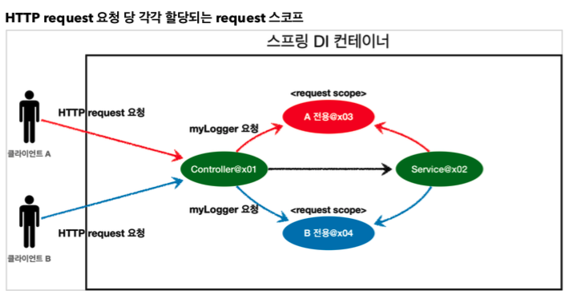

# :book: 스프링 핵심 원리
## :pushpin: 웹 스코프

### 웹 스코프
- 싱글톤은 스프링 컨테이너의 시작과 끝까지 함께하는 매우 긴 스코프
- 프로토타입은 생성과 의존관계 주입, 그리고 초기화까지만 진행하는 특별한 스코프이다.

### 웹 스코프의 특징
- 웹 스코프는 웹 환경에서만 동작한다.
- 웹 스코프는 프로토타입과 다르게 스프링이 해당 스코프의 종료시점까지 관리한다. 따라서 종료 메서드가 호출된다.

### 웹 스코프의 종류
- **request**: HTTP 요청 하나가 들어오고 나갈 때 까지 유지되는 스코프, 각각의 HTTP 요청마다 별도의 빈 인스턴스가 생성되고, 관리된다.
- **session**: HTTP Session과 동일한 생명주기를 가지는 스코프
- **application**: 서블릿 컨텍스트(ServletContext)와 동일한 생명주기를 가지는 스코프
- **websocket**: 웹 소켓과 동일한 생명주기를 가지는 스코프

#### HTTP request 요청 당 각각 할당되는 request 스코프
- 

### 웹 환경 추가
- 웹 스코프는 웹 환경에서만 동작하므로 web 환경이 동작하도록 라이브러리를 추가하자.
```
implementation 'org.spring.framework.boot:spring-boot-starter-web'
```
- 참고: spring-boot-starter-web 라이브러리를 추가하면 스프링 부트는 내장 톰켓 서버를 활용해서 웹 서버와 스프링을 함께 실행시킨다.
- 참고: 스프링부트는 웹 라이브러리가 없으면 우리가 지금까지 학습한 `AnnotationConfigApplicationContext`을 기반으로 애플리케이션을 구동한다.
- 웹 라이브러리가 추가되면 웹과 관련된 추가 설정과 환경들이 필요하므로 `AnnotationConfigServletWebServerApplicationContext`를 기반으로
- 애플리케이션을 구동한다.

- 만약 기본 포트인 8080 포트를 다른 곳에서 사용 중이어서 오류가 발생하면 포트를 변경해야 한다, 9090 포트로 변경하려면 다음 설정을 추가하자
- main/resources/application.properties

```
server.port=9090
```

### request 스코프 예제 개발
- 동시에 여러 HTTP 요청이 오면 정확히 어떤 요청이 남긴 로그인지 구분하기 어렵다. 
- 이럴때 사용하기 딱 좋은 것이 바로 request 스코프이다.
- 기대하는 공통 포멧: [UUID][requestURL]{message}
- UUID를 사용해서 HTTP 요청을 구분하자.
- requestURL 정보도 추가로 넣어서 어떤 URL을 요청해서 남은 로그인지 확인하자.