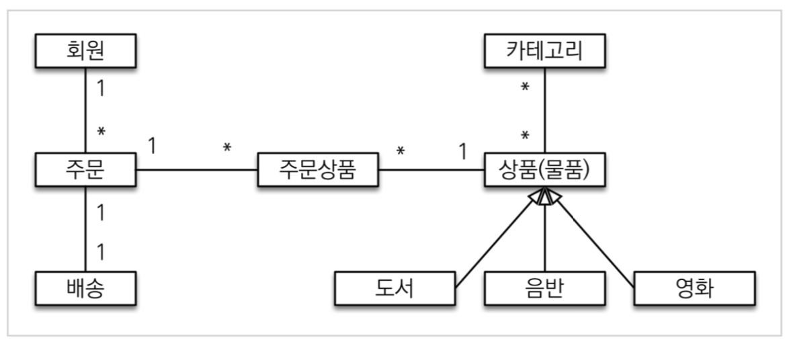
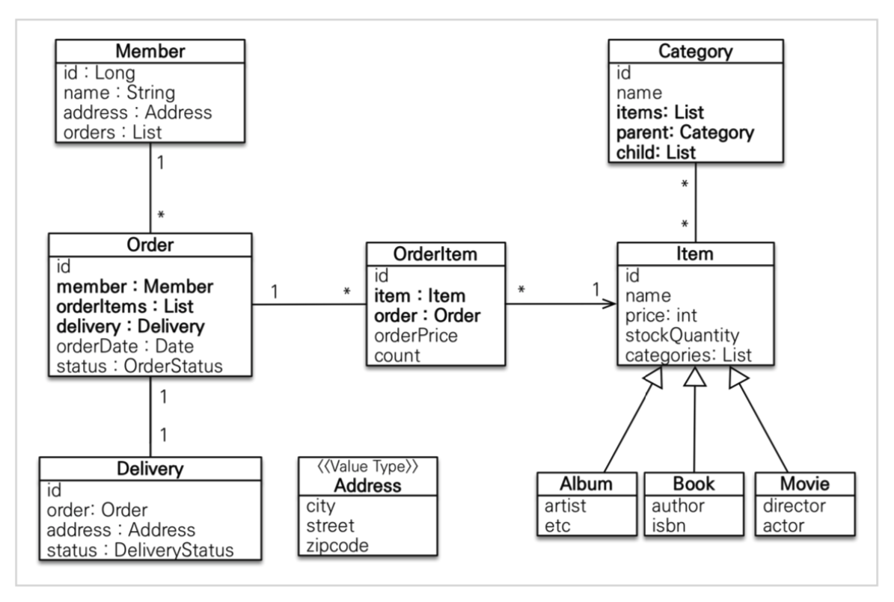
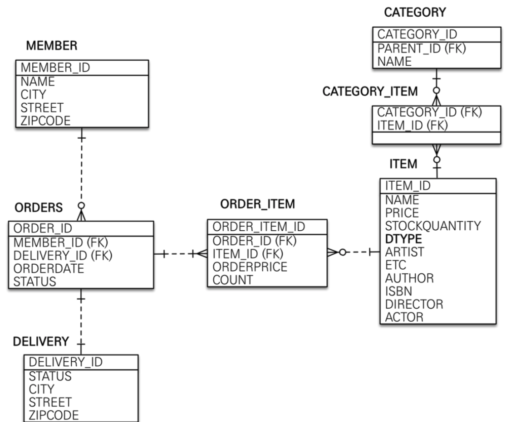

# :book: 실전! 스프링 부트와 JPA 활용

## :pushpin: 살전! 스프링 부트와 JPA 활용

### 도메인 모델과 테이블 설계

- 회원, 주문, 상품의 관계: 회원은 여러 상품을 주문할 수 있다.
그리고 한번 주문할 때 여러 상품을 선택할 수 있으므로 주문과 상품은 다대다 관계다.
하지만 이런 다대다 관계는 관계형 데이터베이스는 물론이고 엔티티에서도 거의 사용하지 않는다.
따라서 그림처럼 주문상품이라는 엔티티를 추가해서 다대다 관계를 일대다, 다대일 관계로 풀어냈다.
- 상품 분류: 상품은 도서, 음반, 영화로 구분되는데 상품이라는 공통 속성을 사용하므로 상속 구조로 표현했다.

### 회원 엔티티 분석

- 회원(Member): 이름과 임베디드 타입인 주소(Address), 그리고 주문(orders) 리스트를 가진다.

- 주문(Order): 한 번 주문시 여러 상품을 주문할 수 있으므로 주문과  주문상품(OrderItem)은 일대다 관계다.
주문은 상품을 주문한 회원과 배송 정보, 주문 날짜, 주문 상태(status)를 가지고 있다. 주문 상태는 열거형을
사용했는데 주문(ORDER), 취소(CANCEL)을 표현할 수 있다.

- 주문상품(OrderItem): 주문한 상품 정보와 주문 금액(orderPrice), 주문 수량(count) 정보를 가지고 있다.
  (보통 OrderLine, LineItem으로 많이 표현한다)

- 상품(Item): 이름, 가격, 재고수량(stockQuantity)을 가지고 있다. 상품을 주문하면 재고 수량이 줄어든다.
상품의 종류로는 도서. 음반, 영화가 있는데 각각은 사용하는 속성이 조금씩 다르다.

- 배송(Delivery: 주문시 하나의 배송 정보를 생성한다. 주문과 배송은 일대일 관계다.

- 카테고리(Category): 상품과 다대다 관계를 맺는다. parent, child로 부모, 자식 카테고리를 연결한다.

- 주소(Address): 값 타입(임베디드 타입)이다. 회원과 배송(Delivery)에서 사용한다.

### 회원 테이블 분석

- 관계형 데이터베이스에서는 다대다 관계 매핑이 안되기 때문에 중간에 CATEGORY_ITEM이라는 매핑 테이블을 두고 다대다 관계를 
일대다, 다대일 관계로 풀어냄

### 연관관계 매핑 분석
- 회원과 주문: 일대다, 다대일의 양방향 관계다. 따라서 연관관계의 주인을 정해야하는데, 외래 키가 있는 주문을 연관관계의 주인으로 정하는 것이 좋다.
그러므로 Order.member를 ORDERS.MEMBER_ID 외래키와 매핑한다.

> **참고: 외래키가 있는 곳을 연관관계의 주인으로 정해라**
> 연관관계의 주인은 단순히 외래 키를 누가 관리하냐의 문제이지 비즈니스상 우위에 있다고 주인으로 정하면 안된다.
예를 들어서 자동차와 바퀴가 있으면, 일대다 관계에서 항상 다쪽에 외래 키가 있으므로 외래 키가 있는 바퀴를 
연관관계의 주인으로 정하면 된다. 물론 자동차를 연관관계의 주인으로 정하는 것이 불가능한 것은 아니지만, 자동차를
> 연관관계의 주인으로 정하면 자동차가 관리하지 않는 바퀴 테이블의 외래 키 값이 업데이트되므로 관리와 
> 유지보수가 어렵고 추가적으로 별도의 업데이트 쿼리가 발생하는 성능 문제도 있다.

### 엔티티 클래스 개발
- 실무에서는 가급적 Getter는 열어두고, Setter는 꼭 필요한 경우에만 사용하는 것을 추천

> 이론적으로 Getter, Setter 모두 제공하지 않고 꼭 필요한 별도의 메서드를 제공하는게 가장 이상적이다.
> 하지만 실무에서 엔티티의 데이터는 조회할 일이 너무 많으므로, Getter의 경우 모두 열어두는 것이 편리하다.
> Getter는 아무리 호출해도 호출하는 것만으로 어떤 일이 발행하지 않는다.
> 하지만 Setter는 문제가 다르다. Setter를 호출하면 데이터가 변한다. Setter를 막 열어두면 가까운 미래에
> 엔티티가 도대체 왜 변경되는지 추적하기 점점 힘들어진다. 그래서 엔티티를 변경할 때는 Setter 대신에
> 변경 지점이 명확하도록 변경을 위한 비즈니스 메서드를 별도로 제공해야 한다.
