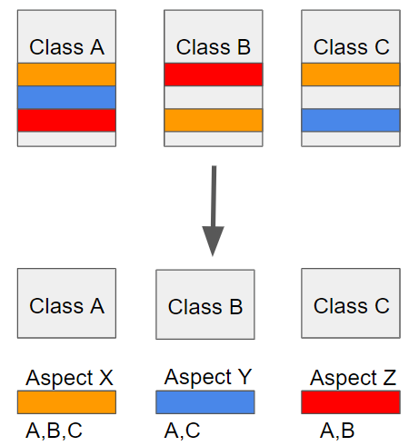

# :book: 스프링5 레시피

## :pushpin: 스프링 코어

### :seedling: 레시피 2-12. POJO에게 IoC 컨테이너 리소스 알려주기

> 컴포넌트가 IoC 컨테이너와 직접적인 의존 관계를 가지도록 설계하는 방법은 바람직하지 않지만 
> 때로는 빈에서 컨테이너의 리소스를 인지해야 하는 경우도 있습니다.

- 빈이 IoC 컨테이너 리소스를 인지하게 하려면 Aware(인지) 인터페이스를 구현함.
- 스프링은 이 인터페이스를 구현한 빈을 감지해 대상 리소스를 세터 메서드로 주입함
- Aware 인터페이스를 구현한 클래스는 스프링과 엮이게 되므로 IoC 컨테이너 외부에서는
제대로 작동하지 않음

- ApplicationContextAware 인터페이스 사용 예제
  - aiotion-core/springApplicationContext.class
    
```
package com.nkia.cygnus.context;

@Component
@Slf4j
public class SpringApplicationContext implements ApplicationContextAware {
    
    private static org.springframework.context.ApplicationContext context;
    
    public static org.springframework.context.ApplicationContext getContext() {
		if(context == null) {
			throw new SpringApplicationContextNotInitializedException("Spring ApplicationContext is not initialized.");
		}
		return context;
	}
	
	@Override
	public void setApplicationContext(org.springframework.context.ApplicationContext context) throws BeansException {
		SpringApplicationContext.context = context;	//NOSONAR
		log.info("SpringApplicationContext initialized");
	}
}
```

- **스프링 최신 버전에서는 Aware 인터페이스를 꼭 구현할 필요가 없음. @Autowired만 붙여도 ApplicationContext를 가져올 수 있음**

### :seedling: 레시피 2-13. 애너테이션을 활용해 애스팩트 지향 프로그래밍하기

> 스프링에서 애너테이션을 이용해 AOP(애스팩트 지향 프로그래밍)하세요.

- 스프링 AOP (Aspect Oriented Programming) : AOP는 Aspect Oriented Programming 의 약자로 관점 지향
프로그래밍이라고 불린다. 관점 지향은 어떤 로직을 기준으로 핵심적인 관점, 부가적인 관점으로 나누어서 보고
  그 관점을 기준으로 각각 모듈화 하겠다는 것이다. 여기서 모듈화란 어떤 공통된 로직이나 기능을 하나의 단위로 묶는
  것을 말한다.




- 애스펙트(aspect)를 정의하려면 일단 자바 클래스에 @Aspect를 붙이고 메서드별로 적절한 애너테이션을 붙여
어드바이스(advice)로 만듬
  
- 어드바이스 애너테이션은 @Before, @After, @AtferReturing, @AfterThrowing, @Around 5개가 있다.
- IoC 컨테이너에서 애스펙트 애너테이션 기능을 활성화하려면 구성 클래스 중 하나에 @EnableAspectJAutoProxy를 붙인다.

- @Aspect 사용 예제 소스코드

```
package com.nkia.cygnus.security.aop;


@Aspect
@Component
public class AuthAspect {
	private static final Logger log = LoggerFactory.getLogger(AuthAspect.class);
	@Autowired
	private AuditLogDao auditLogDao;
	@Autowired
	private CurrentUserContext currentUserContext;
	
	@Around("@annotation(authOp)")
	public Object aroundAuthOperation(ProceedingJoinPoint pjp, AuthOperation authOp) throws Throwable {
		String authDomain = checkAuth(pjp, authOp);
		Object ret = null;
		try {
			ret = pjp.proceed();
		} catch(Exception ex) {
			logAudit(pjp, authOp, authDomain, AuditLog.STATUS_FAILURE, ex.getLocalizedMessage());
			throw ex;
		}
		logAudit(pjp, authOp, authDomain, AuditLog.STATUS_SUCCESS, null);
		return ret;
	}
```
