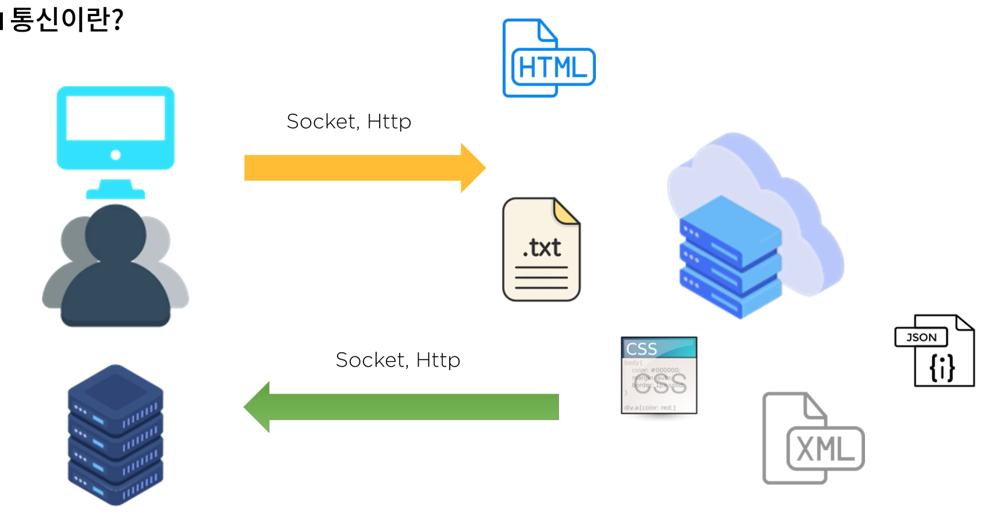

# :book: 스프링부트

## :pushpin: 스프링부트 CRUD 만들기

### :seedling: 통신이란?

- Socket 통신
    - 접속을 계속 유지하여, 데이터를 전달 한다.
    - 서버의 자원에 따라서 연결될 수 있는 클라이언트의 숫자가 한정된다.
    - 실시간 정보 교환에 사용하며 HTTP보다 속도가 빠르다.

- HTTP 통신
    - 클라이언트의 요청이 있을 때만 데이터 응답을 전달한다.
    - 불필요한 자원의 점유를 없애 다른 접속을 원활하게 하여 많은 데이터를 처리한다.
    - 데이터 요청 후 응답이 오면 연결은 끊어진다. 
    
    
### 통신

