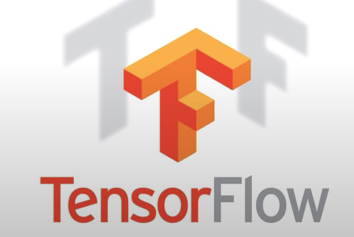
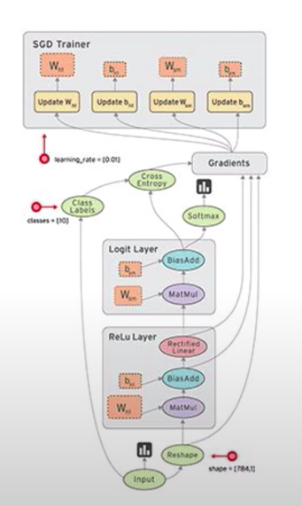

## :book: 모두를 위한 딥러닝 

### TensorFlow

- TensorFlow is an open source software library for numerical computation 
using data flow graph.
- Python!

### What is a Data Flow Graph?

- Nodes in the graph represent mathematical operations
- Edges represent the multidimensional data arrays(tensors) communicated between them.

### Installing TensorFlow

- Linux, Mac OSX, Windows
    - (sudo -H) pip install --upgrade tensorflow
    - (sudo -H) pip install --upgrade tensorflow-gpu

- From source
    - bazel..