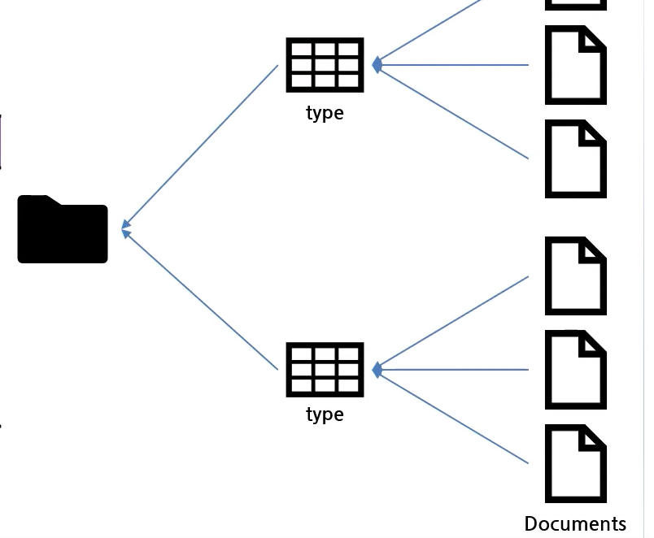

# :book: ElasticSearch

## :pushpin: 엘라스틱서치 CRUD

### 클러스터 탐색 

- REST API
    - 노드와 통신하는 방법
    - Elasticsearch는 클러스터와 상호 작용하는데 사용할 수 있는 매우 포괄적이고 강력한 REST API를 제공
    - API로 수행할 수 있는 몇 가지 작업
        - 클러스터, 노드 및 색인 상태, 상태 및 통계 확인
        - 클러스터, 노드 및 색인 데이터 및 메타 데이터 관리
        - CRUD(Create, Read, Update, Delete) 및 인덱스에 대한 검색 작업 수행
        - 페이징, 정렬, 필터링, 스크립팅, 집계 및 기타 여러 고급 검색 작업 실행
    - "*웹의 장점을 최대한 활용할 수 있는 네트워크 기반의 아키텍쳐*"
    - 구성요소 3가지: 리소스, 메서드, 메시지
    
    


- 클러스터 상태(Health)
    - 클러스터가 어떻게 진행되고 있는지 기본적인 확인
    - 우리는 curl을 사용하여 이를 수행
    - HTTP/REST 호출을 수행할 수 있는 모든 도구를 사용 가능
    - 클러스터 상태를 확인하기 위해 _cat API를 사용
        - 녹색 - 모든 것이 좋음 (클러스터가 완전히 작동함)
        - 노란색 - 모든 데이터를 사용할 수 있지만 일부 복제본은 아직 할당되지 않음 (클러스터는 완전히 작동함)
        - 빨간색 - 어떤 이유로든 일부 데이터를 사용할 수 없음 (클러스터가 부분적으로 작동함)
        
> GET /_cat/nodes?v
    
    
- 데이터베이스가 가진 데이터 확인하기
    - 갖고 있는 모든 인덱스 항목 조회
    - index는 일반 RDB에서의 데이터베이스 역할
    
> GET /_cat/indices?v


### HTTP 메서드와 CRUD, SQL을 비교


HTTP 메서드 | CRUD | SQL | 
------| -----| ------|
GET | Read   | Select
PUT | Update | Update
POST | Create | Insert
DELETE | Delete | Delete


### 엘라스틱서치 데이터 구조

- 인덱스(Index), 타입(Type), 도큐먼트(Document)의 단위를 가짐
- 도큐먼트는 엘라스틱서치의 데이터가 저장되는 최소 단위
- 여러 개의 도큐먼트는 하나의 타입
- 다시 여러 개의 타입은 하나의 인덱스로 구성

관계형 DB | 엘라스틱서치
-------- | --------|
데이터베이스(Database) | 인덱스(Index)
테이블(Table) | 타입(Type)
열(Row) | 도큐먼트(Document)
행(Column) | 필드(Field)
스키마 | 매핑(Mapping)




### 엘라스틱서치의 질의 방법

1. 커맨드라인의 curl 명령어 사용
2. postman 응용프로그램 사용
3. kibana에서 devtool 사용


### 인덱스 만들기

- customer라는 인덱스를 만들어보자.

````
PUT /customer?pretty
GET /_cat/indices?v

<curl 명령어>
curl -X PUT "localhost:9200/customer?pretty"
curl -X GET "localhost:9200/_cat/indices?v"
````


