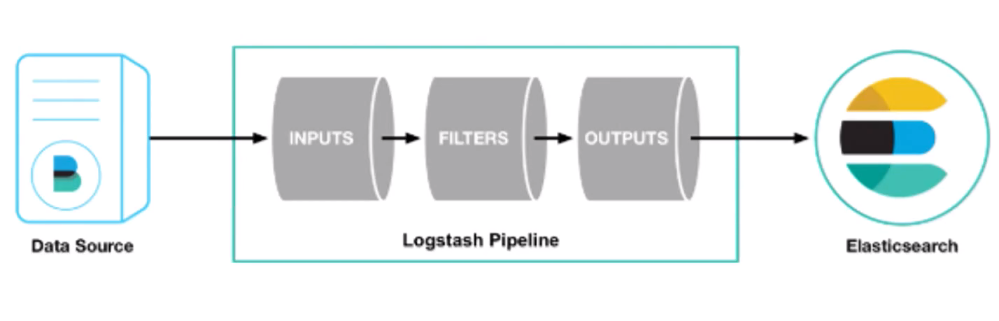
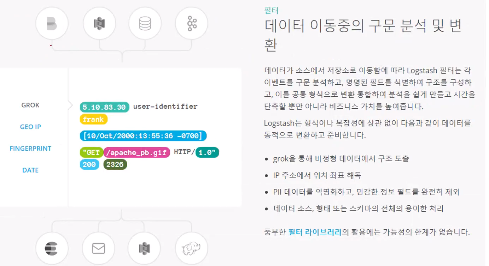

# :book: ElasticSearch

## :pushpin: 로그스태시 / 파일비트 개요

### 로그스태시 개요

- 오픈소스 서버측 데이터 처리로 파이프라인
- 다양한 소스에서 동시에 데이터를 수집하여 변환
- 그 다음 자주 사용하는 엘라스틱 서치에 전달




### 로그스태시의 입력

- https://www.elastic.co/kr/products/logstash


### 로그스태시 필터




### 로그스태시 출력


### 웹로그 자동 수집 Logstash 파이프라인

````
input {
    file {
        codec => json
        path => "c:/logs/*.log"
    }
}
````

```
filter {
    geoip {
        database => "./GeoLite2-City.mmdb"
        source => "ip"
    }
}
```

````
output {
    stdout {
        codec => dots {}
    }
    
    elasticsearch {
        index => "apache_elastic_example"
        template => "./apache_template.json"
        template_name => "apache_elastic_example"
        template_overwrite => true
    }
}
````