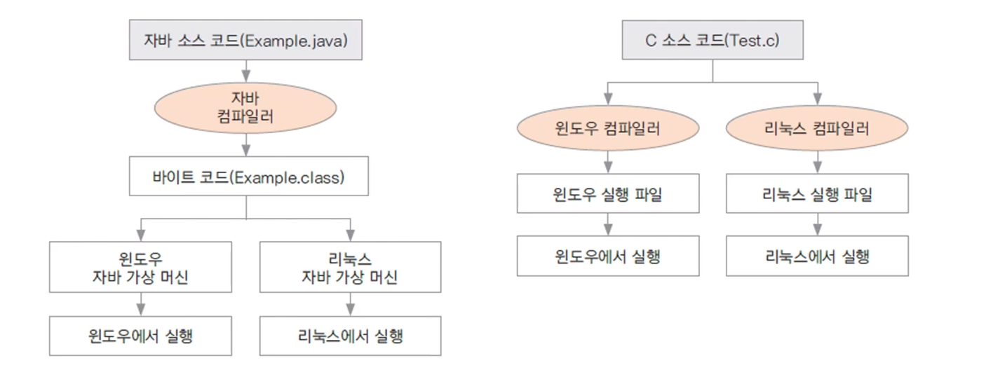
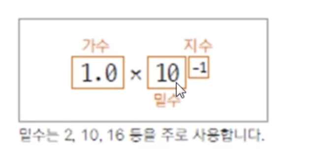
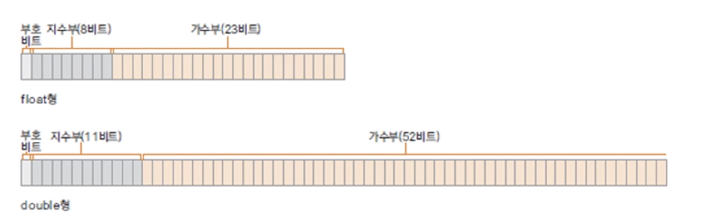

# :book: 프로그래밍

## :pushpin: 프로그래밍이란 


### 프로그래밍

- 컴퓨터에게 일을 시키기 위해 프로그래밍 언어로 만든 명령어 집합인 프로그램을 만드는 일 

### 컴파일

- 프로그래밍 언어를 기계어로 바꾸어 주는 일

### 컴파일러

- 기계어로 바꾸어 주는 프로그램
- 자바를 설치하면 자바 컴파일러도 설치됨


### 자바와 다른 언어와의 차이점

- 플랫폼에 독립적인 프로그래밍을 할 수 있음 





### 자바 프로그램의 특징

- 객체지향 프로그램으로 유지 보수와 확장성이 좋다.
- 안정적이다.
- 풍부한 라이브러리가 제공되고 오픈소스와 연동된다.


### 왜 객체 지향 프로그램을 해야하는가?

- 재사용성
- 유지보수
- 코드 관리
- 신뢰성 높은 프로그램


### 자바로 만들 수 있는 프로그램들

- 웹 서버
- 모바일 앱
- 게임


### 자바 설치

- http://www.oracle.com/technetwork/java/index.html

1. 자바 SE 설치
2. JRE 설치 
3. 이클립스 설치 (http://www.eclipse.org/download)
    - Eclipse IDE for Java Developer
    

### 패키지

- 패키지 : 소스코드들의 묶음
- 패키지는 소문자로 명명한다.
- 클래스는 대문자로 시작한다.
- main : 프로그램의 시작점 
- 문장의 끝은 세미콜론(;)으로 끝난다.
- bin: binary 폴더


## :pushpin: 컴퓨터에서 자료 표현하기

### 컴퓨터에서 자료 표현하는 방법

- 비트(bit): 컴퓨터에서 자료를 표현하는 최소 단위 0 또는 1
- 바이트(byte): 8bit
- 이진수: 컴퓨터에서 표현되는 자료의 형태 
> 0000 1010 (이진수) => 10 (십진수)
- 8진수: 이진수를 3비트씩 모아서 표현
- 16진수: 이진수를 4비트씩 모아서 표현


### 컴퓨터에서 음수 표현하기

- 2의 보수로 표현
- 양수와 음수는 더해서 0이 되어야함


- 2의 보수 만드는 방법 (음수 만드는 방법): 1의 보수를 취하고나서 1을 더해줌


### 변수란 무엇인가

- 변수: 변하는 수
- 사람의 나이, 온라인 상품의 개수, 학생의 학년
- 변하는 값을 프로그램에서 나타내기 위한 방법


### 변수 선언하기

> 자료형 변수 이름;

> int age;

- 변수에 맞는 자료형과 변수 이름으로 선언


### 변수와 메모리

- 변수를 선언하는 것은 해당 자료형의 크기만큼의 메모리를 사용하겠다는 것
- 메모리의 위치를 변수 이름으로 참조


### 변수 이름

- 영문자나 숫자를 사용함. 단 숫자로 시작할 수 없음 1level(x)
- 특수문자 중에는 '_'와 '$'만 사용 가능
- 예약어 (reserved word)는 사용할 수 없음
- 변수는 그 쓰임에 맞는 이름으로 명명하는 것이 가독성에 좋음
- 약어로 쓰는 것은 좋지 않은 습관이다.
- camel notation: numberOfStudent


### 정수 자료형

- 기본형
    - 자바 언어에서 기본적으로 제공해주는 자료형
    - 메모리의 크기가 정해져있음
    - 정수형, 문자형, 실수형, 논리형
- 참조형
    - 클래스 자료형
    - JDK에서 제공되는 클래스와 프로그래머가 정의하는 클래스
    - 클래스에 따라 사용하는 크기가 다름
    - ex) String, Student, ...
    
    
### 기본 자료형


### 문자 자료형

- 내부적으로는 비트의 조합으로 표현
- 인코딩 : 각 문자에 따른 특정한 숫자 값(코드 값)을 부여
- 디코딩 : 숫자 값을 원래의 문자로 변환 


### 문자 세트

- 문자세트 : 문자를 위한 코드 값(숫자 값)들을 정해 놓은 세트
- 아스키(ASCII): 1바이트로 영문자, 숫자, 특수문자 등을 표현함
- 유니코드(Unicode): 한글과 같은 복잡한 언어를 표현하기 위한 표준 인코딩 UTF-8, UTF-16 이 대표적
- 문자를 변수에 저장하면? 문자에 해당하는 코드 값이 저장됨


### 실수와 논리 자료형

- 실수는 double 자료형이 기본
- float를 사용할 때는 f, F 식별자를 사용


### 부동 소수점 방식

- 실수를 지수부와 가수부로 표현함

> 0.1을 표현하는 방식






### 부동 소수점 방식의 오류

- 지수와 가수로 표현되는 부동 소수점은 0을 표현할 수 없음
- 따라서 부동 소수점 방식에서는 약간의 오차가 발생할 수 있음


### 논리 자료형

- boolean 으로 선언
- 논리값 true(참), false(거짓)을 표현


### 자료형 없이 변수 사용하기 (자바 10)

- 지역 변수 자료형 추론 (local variable type inference)
- 변수에 대입되는 값을 보고 컴파일러가 추론

```
var num = 10;
var dNum = 10.0;
var str = "hello";
```

```
int num = 10;
double dNum = 10.0;
String str = "hello";
```


### 상수와 리터럴 

- 상수(constant): 변하지 않는 수
- 리터럴(literal): 프로그램에서 사용하는 모든 숫자, 값, 논리값
    - 예) 10, 3.14, 'A', true
- 모든 리터럴은 상수 풀(constant pool)에 저장되어 있음
- 상수 풀에 저장될 때 정수는 int, 실수는 double로 저장됨


