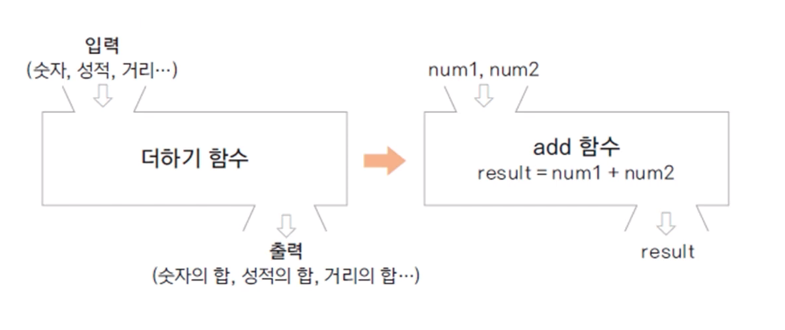

# :book: 객체지향 프로그래밍 기초

## :pushpin: 객체지향 프로그래밍과 클래스 

## :seedling: 객체란 무엇인가요?

### 객체 (Object)

- 의사나 행위가 미치는 대상 (사전적 의미)
- 구체적, 추상적 데이터의 단위
    - 예: 사람, 자동차, 주문, 생산, 관리


### 객제 지향 프로그래밍(Object Oriented Programming: OOP)

- 객체를 기반으로 하는 프로그래밍
- 객체를 정의하고, 객체의 기능을 구현하며, 객체간의 협력(cooperation)을 구현

cf. 절차 지형 프로그래밍 (Procedural Programming)

- 시간이나 사건의 흐름에 따른 구현
- C 언어 


### 학교가는 과정을 구현한 절차 지향 프로그래밍

- 절차 지향 프로그래밍 

> 일어난다 -> 씻는다 -> 밥을 먹는다 -> 버스를 탄다 -> 요금을 지불한다 -> 학교에 도착

- 객체지향 프로그래밍 


## :seedling: 클래스(class)

- 객체를 코드를 구현한 것
- 객체 지향 프로그래밍의 가장 기본 요소
- 객체의 청사진(blueprint)


### 멤버변수, 메서드

> 멤버변수

- 객체가 가지는 속성을 변수로 표현
- 클래스의 멤버변수
- member variable, property, attribute,

> 메서드

- 객체의 기능을 구현
- method, member function


### 클래스 생성하기

- new 키워드를 사용하여 생성자로 생성

> Student studentLee = new Student();


### 클래스의 속성, 메서드 참조하기

- 생성에 사용한 변수(참조변수)로 클래스의 속성, 메서드 참조

- studentLee.studentName = "Lee";
- studentLee.showStudentInfo();


### public 클래스

- 자바 파일 하나에 여러 개의 클래스가 존재할 수도 있음
- 단, public 클래스는 하나이고, public 클래스와 자바 파일 이름은 동일해야함 


## :seedling: 함수와 메서드

### 함수(function) 

- 하나의 기능을 수행하는 일련의 코드
- 함수는 호출하여 사용하고 기능이 수행된 후 값을 반환할 수 있음
- 함수로 구현된 기능은 여러 곳에서 호출되어 사용될 수 있음 


### 함수의 입력과 반환




### 함수 정의하기

- 함수는 이름, 매개변수, 반환 값, 함수 몸체(body)로 구성됨

```
int add(int num1, int num2) 
{
    int result;
    result = num1 + num2;
    return result;    
} 

```