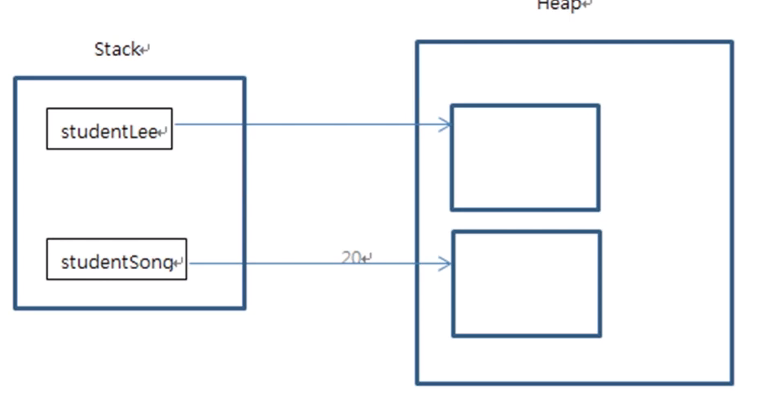
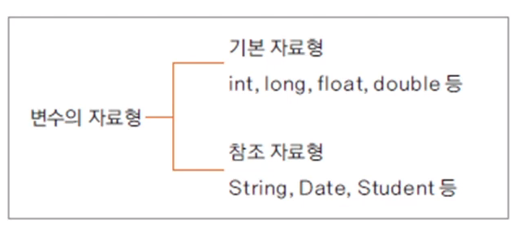
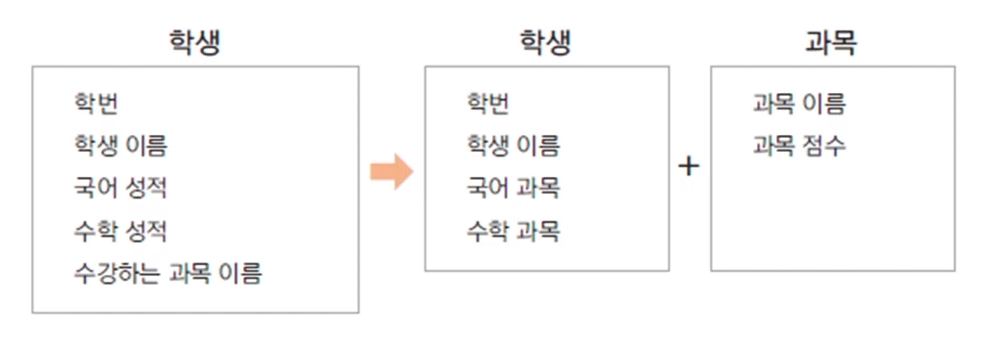

# :book: 객체지향 프로그래밍 기초

## :pushpin: 객체지향 프로그래밍과 클래스 

## :seedling: 객체란 무엇인가요?

### 객체 (Object)

- 의사나 행위가 미치는 대상 (사전적 의미)
- 구체적, 추상적 데이터의 단위
    - 예: 사람, 자동차, 주문, 생산, 관리


### 객제 지향 프로그래밍(Object Oriented Programming: OOP)

- 객체를 기반으로 하는 프로그래밍
- 객체를 정의하고, 객체의 기능을 구현하며, 객체간의 협력(cooperation)을 구현

cf. 절차 지형 프로그래밍 (Procedural Programming)

- 시간이나 사건의 흐름에 따른 구현
- C 언어 


### 학교가는 과정을 구현한 절차 지향 프로그래밍

- 절차 지향 프로그래밍 

> 일어난다 -> 씻는다 -> 밥을 먹는다 -> 버스를 탄다 -> 요금을 지불한다 -> 학교에 도착

- 객체지향 프로그래밍 


## :seedling: 클래스(class)

- 객체를 코드를 구현한 것
- 객체 지향 프로그래밍의 가장 기본 요소
- 객체의 청사진(blueprint)


### 멤버변수, 메서드

> 멤버변수

- 객체가 가지는 속성을 변수로 표현
- 클래스의 멤버변수
- member variable, property, attribute,

> 메서드

- 객체의 기능을 구현
- method, member function


### 클래스 생성하기

- new 키워드를 사용하여 생성자로 생성

> Student studentLee = new Student();


### 클래스의 속성, 메서드 참조하기

- 생성에 사용한 변수(참조변수)로 클래스의 속성, 메서드 참조

- studentLee.studentName = "Lee";
- studentLee.showStudentInfo();


### public 클래스

- 자바 파일 하나에 여러 개의 클래스가 존재할 수도 있음
- 단, public 클래스는 하나이고, public 클래스와 자바 파일 이름은 동일해야함 


## :seedling: 함수와 메서드

### 함수(function) 

- 하나의 기능을 수행하는 일련의 코드
- 함수는 호출하여 사용하고 기능이 수행된 후 값을 반환할 수 있음
- 함수로 구현된 기능은 여러 곳에서 호출되어 사용될 수 있음 


### 함수의 입력과 반환


### 함수 정의하기

- 함수는 이름, 매개변수, 반환 값, 함수 몸체(body)로 구성됨

```
int add(int num1, int num2) 
{
    int result;
    result = num1 + num2;
    return result;    
} 

```


### 메서드 (method)

- 객체의 기능을 구현하기 위해 클래스 내부에 구현되는 함수
- 메서드를 구현함으로써 객체의 기능이 구현됨
- 메서드의 이름은 사용하는 쪽(클라이언트 코드)에 맞게 명명하는 것이 좋음
    - ex) getStudentName()  (camel notation)


### 인스턴스

- 클래스로부터 생성된 객체 
- 힙 메모리에 멤버 변수의 크기에 따라 메모리가 생성
- 클래스를 기반으로 new 키워드를 이용하여 여러 개의 인스턴스를 생성




### 참조 변수와 참조값

> Student studentLee = new Student();

> System.out.println(studentLee);   // 참조변수를 출력


### 용어 정리


| 용어 | 설명 |
| --- | ----|
| 객체 | 객체 지향 프로그램의 대상, 생성된 인스턴스 |
| 클래스 | 객체를 프로그래밍하기 위해 코드로 만든 상태 |
| 인스턴스 | 클래스가 메모리에 생성된 상태 |
| 멤버 변수 | 클래스의 속성, 특성 |
| 메서드 | 멤버 변수를 이용하여 클래스의 기능을 구현 |
| 참조 변수 | 메모리에 생성된 인스턴스를 가리키는 변수 |
| 참조 값 | 생성된 인스턴스의 메모리 주소 값 |


### 생성자 (constructor)

- 객체를 생성할 때 new 키워드와 함께 호출 (객체 생성 외에는 호출할 수 없음)
- 인스턴스를 초기화 하는 코드가 주로 구현됨 (주로 멤버변수 초기화)
- 반환 값이 없음, 상속되지 않음
- 생성자는 클래스 이름과 동일 


### 기본 생성자 (default constructor)

- 하나의 클래스에는 반드시 하나 이상의 생성자가 존재해야함
- 프로그래머가 생성자를 구현하지 않으면 컴파일러가 생성자 코드를 넣어줌

> 기본 생성자

- 기본 생성자는 매개 변수가 없고, 구현부가 없음
- 만약 클래스에 다른 생성자가 있는 경우 디폴트 생성자는 제공되지 않음 


### 생성자 오버로딩 (constructor overloading)

- 생성자를 두 개 이상 구현하는 경우
- 사용하는 코드에서 여러 생성자 중 선택하여 사용할 수 있음
- private 변수도 생성자를 이용하여 초기화를 할 수 있음 


### 참조 자료형 (reference data type)

- 변수의 자료형



- 클래스형으로 변수를 선언함

```
String name;
```

- 기본 자료형은 사용하는 메모리가 정해져 있지만, 참조 자료형은 클래스에 따라 다름 


### 참조 자료형 직접 만들어 사용하기

> 학생 클래스(Student)에 있는 과목 이름, 과목 성적 속성을 과목 클래스(Subject)로 분리하고
Subject 참조 자료형 멤버 변수를 Student에 정의하여 사용함 



