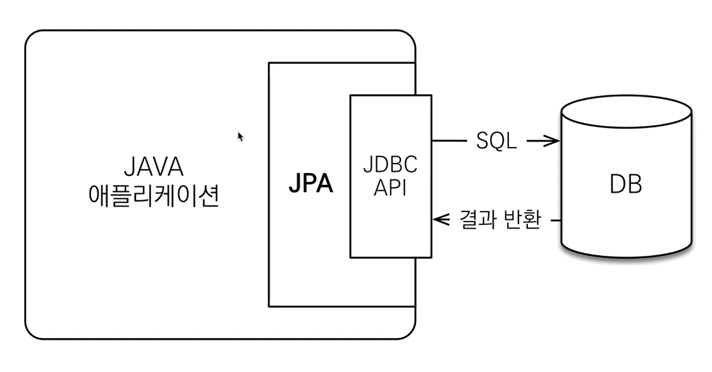

## JPA 소개

### JPA?
- Java Persistence API
- 자바 진영의 ORM 기술 표준

### ORM?
- Object-relational mapping(객체 관계 매핑)
- 객체는 객체대로 설계
- 관계형 데이터베이스는 관계형 데이터베이스대로 설계
- ORM 프레임워크가 중간에서 매핑
- 대중적인 언어에는 대부분 ORM 기술이 존재

### JPA는 애플리케이션과 JDBC 사이에서 동작

### JPA 소개

- EJB 엔티티 빈(자바 표준)
- 하이버네이트 (오픈 소스)
- JPA (자바 표준)
