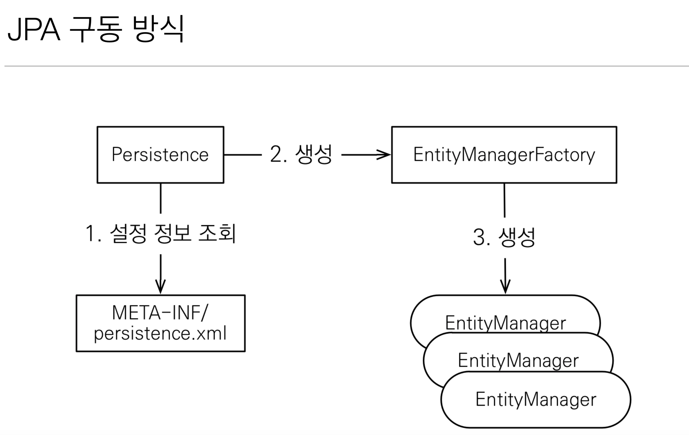

## JPA 실

### JPA 구동 방식

### 객체와 테이블을 생성하고 매핑하기

- @Entity: JPA가 관리할 객체
- @Id: 데이터베이스 PK와 매핑 

### 주의

- 엔티티 매니저 팩토리는 하나만 생성해서 애플리케이션 전체에서 공유
- 엔티티 매니저는 쓰레드간에 공유X (사용하고 버려야한다).
- JPA의 모든 데이터 변경은 트랜잭션 안에서 실행