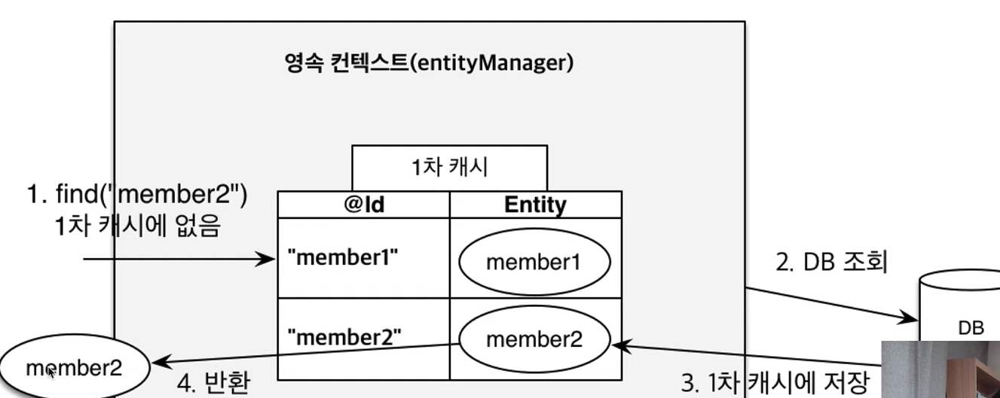
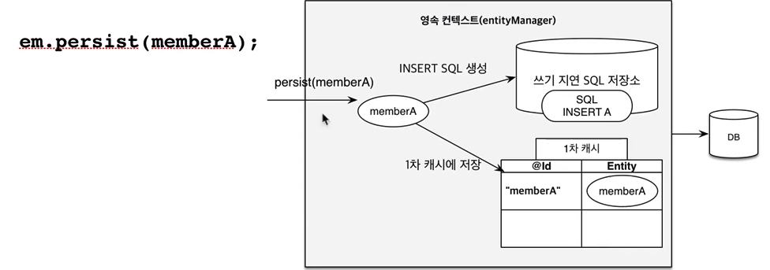

## 영속성 컨텍스트1


### JPA에서 가장 중요한 2가지

- 객체와 관계형 데이터베이스 매핑하기 (Object Relational Mapping)
- 영속성 컨텍스트 


### 엔티티 매니저 팩토리와 엔티티 매니저


### 영속성 컨텍스트

- JPA를 이해하는데 가장 중요한 용어
- "엔티티를 영구 저장하는 환경" 이라는 뜻
- EntityManager.persist(entity);


### 엔티티 매니저? 영속성 컨텍스트?

- 영속성 컨텍스트는 논리적인 개념
- 눈에 보이지 않는다.
- 엔티티 매니저를 통해서 영속성 컨텍스트에 접근 


### 엔티티의 생명주기

- 비영속 (new/transient)
    - 영속성 컨텍스트와 전혀 관계가 없는 새로운 상태
- 영속 (managed)
    - 영속성 컨텍스트에 관리되는 상태
- 준영속 (detached)
    - 영속성 컨텍스트에 저장되었다가 분리된 상태
- 삭제 (removed)
    - 삭제된 상태


### 비영속

````
// 객체를 생성한 상태 (비영속)

Member member = new Member();
member.setId("member1");
member.setUsername("회원1");
````


### 영속

````
// 객체를 저장한 상태 (영속)
em.persist(member);
````


### 준영속

````
// 회원 엔티티를 영속성 컨텍스트에서 분리, 준영속 상태
em.detach(member);
````


### 객체를 삭제한 상태 (삭제)

````
em.remove(member);
````


### 영속성 컨텍스트의 이점

- 1차 캐시
- 동일성(identity) 보장
- 트랜잭션을 지원하는 쓰기 지연 (transactional write-behind)
- 변경 감지 (Dirty Checking)
- 지연 로딩 (Lazy Loading)


### 엔티티 조회, 1차 캐시 

````
// 엔티티를 생성한 상태 (비영속)
Member member = new Member();
member.setId("member1");
member.setUsername("회원1");

// 엔티티를 영속
em.persist(member);
````

### 1차 캐시에서 조회

````
Member member = new Member();
member.setId("member");
member.setUsername("회원1");

// 1차 캐시에 저장됨
em.persist(member);

// 1차 캐시에서 조회
Member findMember = em.find(Member.class, "member1");
````


;


### 데이터베이스에서 조회

````
Member findMember2 = em.find(Member.class, "member2");
````

> 1. find("member2")    // 1차 캐시에 없음
> 2. DB 조회
> 3. 1차 캐시에 저장
> 4. 반환  




### 영속 엔티티의 동일성 보장 

````
Member a = em.find(Member.class, "member1");
Member b = em.find(Member.class, "member2");

System.out.println(a == b);     // 동일성 비교 true
````

- 1차 캐시로 반복 가능한 읽기(REPEATABLE READ) 등급의 트랜잭션 격리 수준을 데이터베이스가 아닌
애플리케이션 차원에서 제공


### 엔티티 등록
- 트랜잭션을 지원하는 쓰기 지연

```
EntityManager em = emf.createEntityManager();
EntityTransaction transaction = em.getTransaction();

// 엔티티 매니저는 데이터 변경시 트랜잭션을 시작해야 한다.
transaction.begin();    // [트랜잭션] 시작

em.persist(memberA);
em.persist(memberB);
// 여기까지 INSERT SQL을 데이터베이스에 보내지 않는다.

// 커밋하는 순간 데이터베이스에 INSERT SQL을 보낸다.
transaction.commit():   // [트랜잭션] 커밋 

```





- transaction.commit();


### 엔티티 수정 변경 감지

````
EntityManager em = emf.createEntityManager();
EntityTransaction transaction = em.getTransaction();
transaction.begin();

Member memberA = em.find(Member.class, "memberA");

memberA.setUsername("임슬기");
memberA.setAge(25);

// em.update(member) 이런 코드가 있어야하지 않을까? JPA는 필요없다.

transaction.commit();
````


### 엔티티 삭제

````
// 삭제 대상 엔티티 조회
Member memberA = em.find(Member.class, "memberA");

em.remove(memberA); // 엔티티 삭제 
````


### 플러시

- 영속성 컨텍스트의 변경 내용을 데이터베이스에 반영 