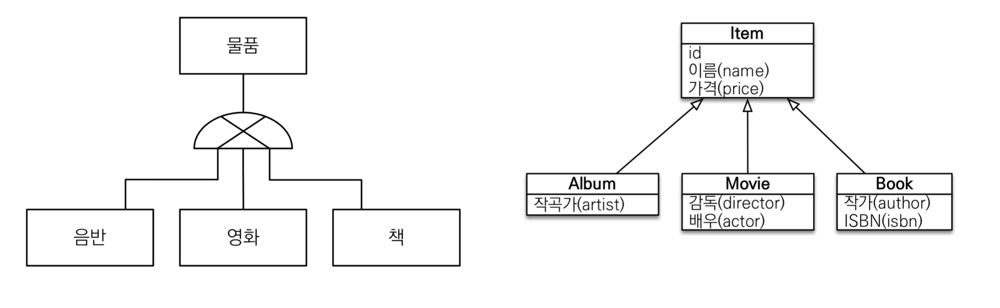

# :book: 자바 ORM 프로그래밍 기본편 

## :pushpin: 상속관계 매핑 

### 상속관계 매핑

- 관계형 데이터베이스는 상속 관계 X
- 슈퍼타입 서브타입 관계라는 모델링 기법이 객체 상속과 유사
- 상속관계 매핑: 객체의 상속과 구조와 DB의 슈퍼타입 서브타입 관계를 매핑

### 슈퍼 타입 서브타입 논리 모델을 실제 물리 모델로 구현하는 방법

- 각각 테이블로 변환 -> 조인 전략
- 통합 테이블로 변환 -> 단일 테이블 전략
- 서브타입 테이블로 변환 -> 구현 클래스마다 테이블 전략

### 조인 전략

### 단일 테이블 전략

### 구현 클래스마다 테이블 전략 

### 주요 어노테이션

- @Inheritance(strategy = InheritanceType.XXX)
    - JOINED: 조인 전략
    - SINGLE_TABLE: 단일 테이블 전략
    - TABLE_PER_CLASS: 구현 클래스마다 테이블 전략
    
- @DiscriminatorColumn(name="DTYPE")
- @DiscriminatorValue("XXX")

