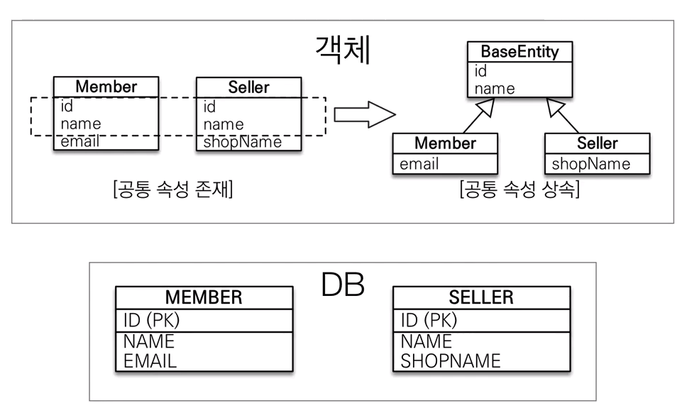

# :book: 자바 ORM 프로그래밍 기본편

## :pushpin: MappedSuperclass - 매핑 정보 상속

> @MappedSuperclass

- 공통 매핑 정보가 필요할 때 사용 (id, name)

- 상속관계 매핑 X

- 엔티티 X, 테이블과 매핑 X

- 부모 클래스를 상속받는 자식 클래스에 매핑 정보만 제공

- 조회, 검색 불가(em.find(BaseEntity) 불가)

- 직접 생성해서 사용할 일이 없으므로 추상 클래스 권장

- 테이블과 관계 없고, 단순히 엔티티가 공통으로 사용하는 매핑 정보를 모으는 역할

- 주로 등록일, 수정일, 등록자, 수정자 같은 전체 엔티티에서 공통으로 적용하는 정보를 모을 때 사용

- 참고: @Entity 클래스는 엔티티나 @MappedSuperclass로 지정한 클래스만 상속 가능 

    - @Entity: 상속관계 매핑
    - @MappedSuperclass: 속성만 매핑