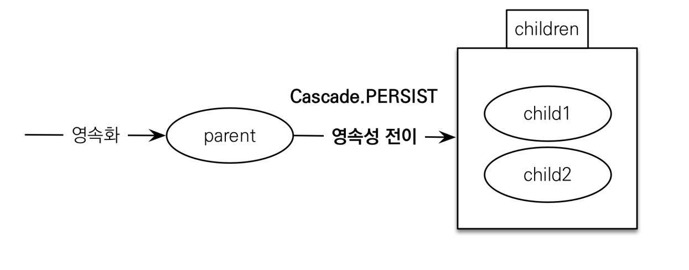

# :book: 자바 ORM 프로그래밍 기본편

## :pushpin: 영속성 전이: CASCADE

### 영속성 전이: CASCADE

- 특정 엔티티를 영속 상태로 만들 때 연관된 엔티티도 함께 영속 상태로 만들고 싶을 때
    - 예: 부모 엔티티를 저장할 때 자식 엔티티도 함께 저장.
    


### 영속성 전이: 저장

```
@OneToMany(mappedBy="parent", cascade=CascadeType.PERSIST)
```




```
@Entity
public class Parent {

  @Id
  @GeneratedValue
  private Long id;
  
  private String name;
  
  @OneToMany(mappedBy = "parent", cascade = CascadeType.ALL)
  private List<Child> childList = new ArrayList<>();
  
  public void addChild(Child child) {
    childList.add(child);
    child.setParent(this);
  }
  // getter setter
}
```

```
@Entity
public class Child {

  @Id
  @GeneratedValue
  private Long id;
  
  private String name;
  
  @ManyToOne
  @JoinColumn(name = "parent_id")
  private Parent parent;
  
  // getter setter
  
}
```

```
public class JpaMain {

  public static void main(String[] args) {
    EntityManagerFactory emf = Persistence.createEntityManagerFactory("hello");
    EntityManager em = emf.createEntityManager();
    
    EntityTransaction tx = em.getTransaction();
    tx.begin();
    
    try {
      
      Child child1 = new Child();
      Child child2 = new Child();
      
      Paranet parent = new Parent();
      parent.addChild(child1);
      parent.addChild(child2);
      
      em.persist(parent);
      // em.persist(child1);  // parent를 persist할 때 child도 persist 되도록 해줌
      // em.persist(child2);
      
      tx.commit(); 
    } catch (Exception e) {
      tx.rollback();
    }
  }
}
```


### 영속성 전이: CASCADE - 주의!

- 영속성 전이는 연관관계를 매핑하는 것과 아무 관련이 없음
- 엔티티를 영속화할 때 연관된 엔티티도 함께 영속화하는 편리함을 제공할 뿐 


### CASCADE의 종류

- **ALL: 모두 적용**
- **PERSIST: 영속**
- **REMOVE: 삭제**
- MERGE: 병합
- REFRESH: REFRESH
- DETACH: DETACH


### 고아 객체
- 고아 객체 제거: 부모 엔티티와 연관관계가 끊어진 자식 엔티티를 자동으로 삭제
- orphanRemoval = true

```
Parent parent1 = em.find(Parent.class, id);
parent1.getChildren().remove(0);
// 자식 엔티티를 컬렉션에서 제거
```
 
- DELETE FROM CHILD WHERE ID=?


### 고아 객체 - 주의
- 참조가 제거된 엔티티는 다른 곳에서 참조하지 않는 고아 객체로 보고 삭제하는 기능
- 참조하는 곳이 하나일 때 사용해야함!
- 특정 엔티티가 개인 소유할 때 사용
- @OneToOne, @OneToMany만 가능
- 참고: 개념적으로 부모를 제거하면 자식은 고아가 된다. 따라서 고아 객체 제거 기능을 활성화하면,
부모를 제거할 때 자식도 함께 제거된다. 이것은 CascadeType.REMOVE처럼 동작한다.


### 영속성 전이 + 고아 객체, 생명 주기

- CascadeType.ALL + orphanRemoval = true
- 스스로 생명주기를 관리하는 엔티티는 em.persist()로 영속화,
em.remove()로 제거
- 두 옵션을 모두 활성화 하면 부모 엔티티를 통해서 자식의 생명주기를 관리할 수 있음
- 도메인 주도 설계(DDD)의 Aggregate Root 개념을 구현할 때 유용