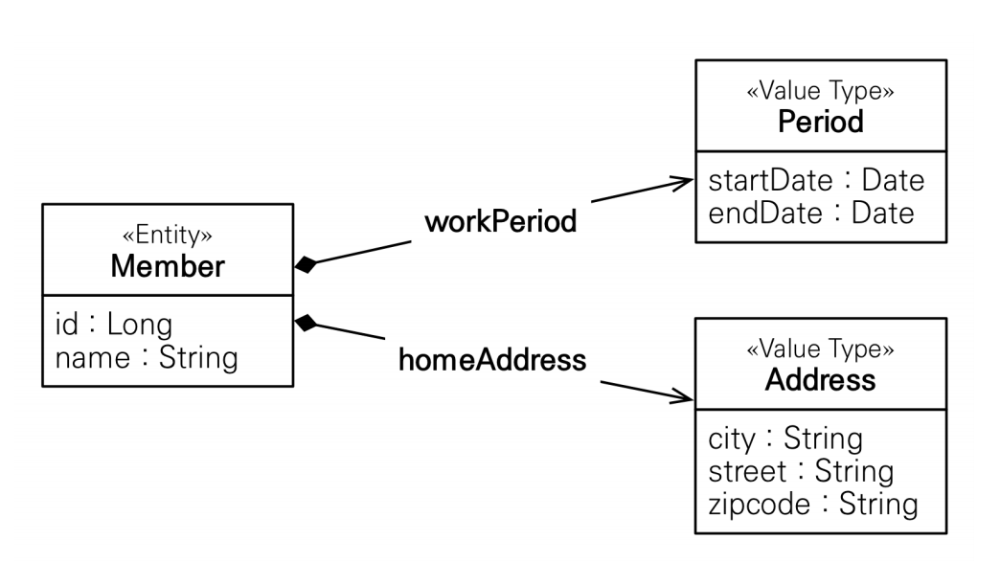

# :book: 자바 ORM 프로그래밍 기본편

## :pushpin: 임베디드 타입 (복합 값 타입)

### 임베비드 타입
- 새로운 값 타입을 직접 정의할 수 있음
- JPA는 임베디드 타입(embedded type)이라 함
- 주로 기본 값 타입을 모아서 만들어서 복합 값 타입이라고도 함
- int, String과 같은 값 타입

### 임베디드 타입
- 회원 엔티티는 이름, 근무 시작일, 근무 종료일, 주소 도시, 주소 번지, 주소 우편번호를 가진다.


- 회원 엔티티는 이름, 근무 기간, 집 주소를 가진다.





### 임베디드 타입 사용법
- @Embeddable: 값 타입을 정의하는 곳에 표시
- @Embedded: 값 타입을 사용하는 곳에 표시
- 기본 생성자 필수

### 임베디드 타입의 장점
- 재사용
- 높은 응집도
- Period.isWork() 처럼 해당 값 타입만 사용하는 의미 있는 메소드를 만들 수 있음
- 임베디드 타입을 포함한 모든 값 타입은, 값 타입을 소유한 엔티티에 생명주기를 의존함

### 임베디드 타입과 테이블 매핑


```
@Entity
public class Member {
    
    @Id
    @GeneratedValue
    @Column(name = "MEMBER_ID")
    private Long id;
    
    @Column(name = "USERNAME")
    private String username;
    
    // 기간 Period
    @Embedded
    private Period workPeriod;
    
    // 주소
    @Embedded
    private Address homeAddress;
}
```

```
@Embeddable
public class Period {

    private LocalDateTime startDate;
    private LocalDateTime endDate;
    
    public boolean isWork() {
        ...
    }
    
    // 생성자
}
```

```
@Embeddable
public class Address {

    private String city;
    private String street;
    private String zipcode;
    
    // 생성자
}
```

### 임베디드 타입과 테이블 매핑
- 임베디드 타입은 엔티티의 값일 뿐이다.
- 임베디드 타입을 사용하기 전과 후에 **매핑하는 테이블은 같다.**
- 객체와 테이블을 아주 세밀하게 (find-grained) 매핑하는 것이 가능
- 잘 설계한 ORM 애플리케이션은 매핑한 테이블의 수보다 클래스의 수가 더 많음

### @AttributeOverride: 속성 재정의
- 한 엔티티에서 같은 값 타입을 사용하면?
- 컬럼 명이 중복됨
- @AttributeOverrides, @AttributeOverride를 사용해서 컬럼 명 속성을 재정의 

```
@Entity
public class Member {
    ...
    @Embedded
    private Address homeAddress;
    
    @Embedded
    @AttributeOverrides({
        @AttributeOverride(name = "city",
                    column=@Column(name = "WORK_CITY")),
        @AttributeOverride(name = "street",
                    column=@Column(name = "WORK_STREET")),
        @AttributeOverride(name = "zipcode",
                    column=@Column(name = "WORK_ZIPCODE"))
    })
    private Address workAddress;
}
```

### 임베디드 타입과 null
- 임베디드 타입의 값이 null 이면 매핑한 컬럼 값은 모두 null

