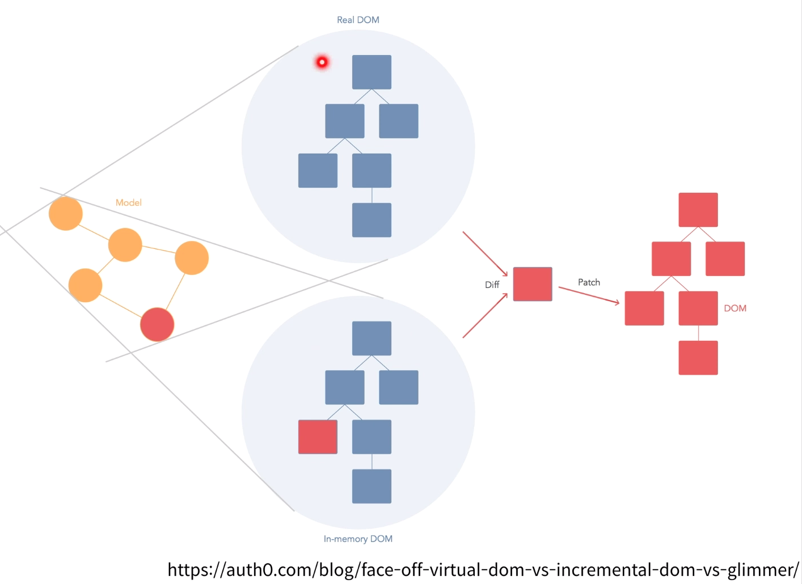
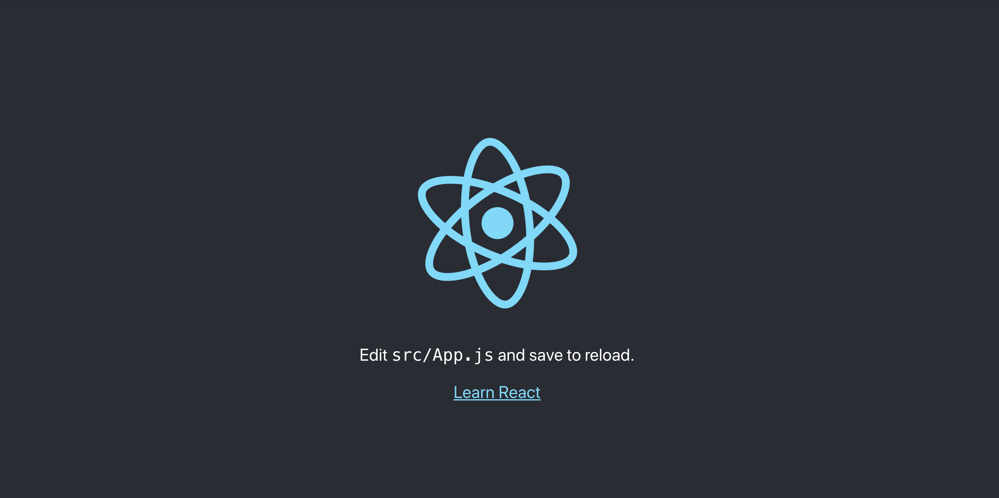
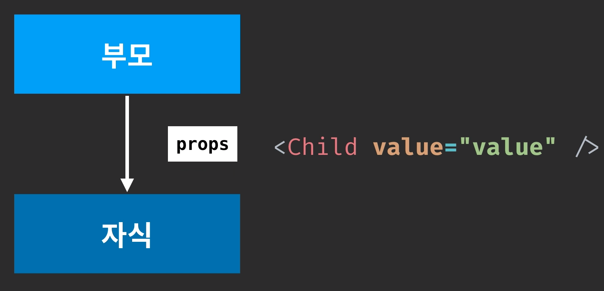

# :book: 벨로퍼트와 함께 하는 모던 리액트

## :pushpin: 리액트 입


### 리액트는 어쩌다 만들어졌을까

- JavaScript를 사용한 DOM 변형 


- Ember, Backbone, AngularJS, ...


### 리액트 개발팀의 새로운 발상

- Virtual DOM (가상의 DOM)



- UI를 어떻게 업데이트할지가 아니라 UI를 어떯게 보여줄지 집중!


### 컴포넌트

- UI 조각

```
const Hello = ({ name }) => <div> Hello, {name} </div>

```


### 작업환경 준비하기 


### 새 프로젝트 만들어보기 

- 새로운 리액트 프로젝트를 만들기
- 터미널을 열은 뒤, 다음 명령어를 실행 (윈도우 사용자는 Git Bash를 사용)

````
$ npx create-react-app begin react
````

```
cd begin-react
yarn start
```





### JSX

- 태그는 꼭 닫혀야한다.

````
<div> 태그는 꼭 닫혀야한다! </div>
<Hello />
````

- 두개 이상의 태그는 감싸자

```
<>
    <div> 두개 이상의 </div>
    <p> 태그는 감싸자 </p>
</>
```

- JavaScript 값 표현하기

````
const name = '이렇게';
return <div> JavaScript 값을 보여줄 땐, {name} </div>
````

- JSX 내부에서 스타일 사용 

````
const style = {
    background: 'gray',
}
return (
    <div style={style}>
        <div className="my-style">
            style 과 className
        </div>
    </div>
}
````

- 주석

````
return (
    <div>
        {/*주석은 이렇게*/}
        <input 
            // 또는 이렇게 
        />
    </div>
)
````


### props를 통해 컴포넌트에게 값 전달하기

