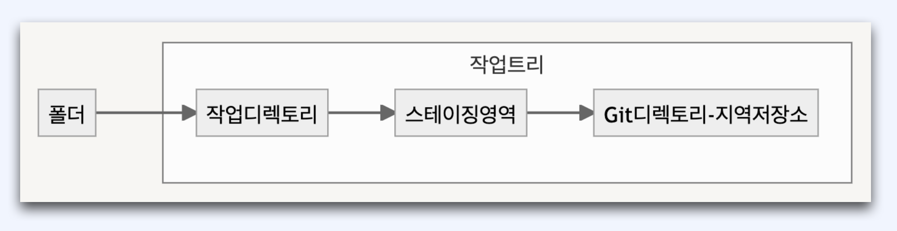

# :book: 백엔드 개발자를 위한 대용량 데이터 & 트래픽 처리
## :pushpin: Part 5-1. 스타트업 초기 서비스 개발

### :seedling: 버전관리 - Git, Github 이론 I
### 1. 버전 관리(VCS)의 이해
### 버전 관리란?
> 한마디로 파일의 타임머신

- 파일의 변화를 기록 (변경점 관리)
- 복구, 특정 시점의 파일을 가져온다.
- 수정된 내용을 비교 가능하다.
- 추적이 가능하다.

### 전통적인(?) 버전 관리
- 압축(zip)
- 날짜별 파일 또는 디렉토리

### 버전 관리 도구의 형태
- 로컬
  - 간단한 형태의 로컬 버전 관리 DB
- 중앙 집중식
  - CVS
  - Subversion
- 분산
  - Git

### Git이란?
- 분산 버전 관리 시스템
- 리누스 토발즈와 다른 커널 개발자
- 리눅스 커널 개발에 사용(2005년)
- 무료, 오픈소스
- 모든 OS지원
- 사실상 업계 표준

### Git의 특징
- 작고 빠르다
- 추적
- 브랜치와 머지
- 변경 이력
- 분산 버전 관리

### Git의 버전 관리 개념
기본적으로 **3단계** 개념
- 워킹 디렉토리(작업 디렉토리)
- 스테이징 영역: 단순한 파일을 지칭, 커밋할 파일의 정보 저장 (인덱스)
- Git 디렉토리: 프로젝트의 메타 정보, 객체 데이터베이스

### Github란?
- 2008년 호스팅 시작
- Git을 이용하는 프로젝트들의 원격 저장소
- 2018년 마이크로소프트에 인수
- 공개 저장소 제공 (Public)
- 개인 저장소 제공 (Private)

### Github 특징
- 원격 저장소 및 호스팅
- 비공개 저장소, 공개 저장소
- 빌드 및 배포 자동화
- 프로젝트 관리 기능
- 이슈 관리 기능
- 위키 제공
- 정적 페이지 호스팅
- 코드 조각
