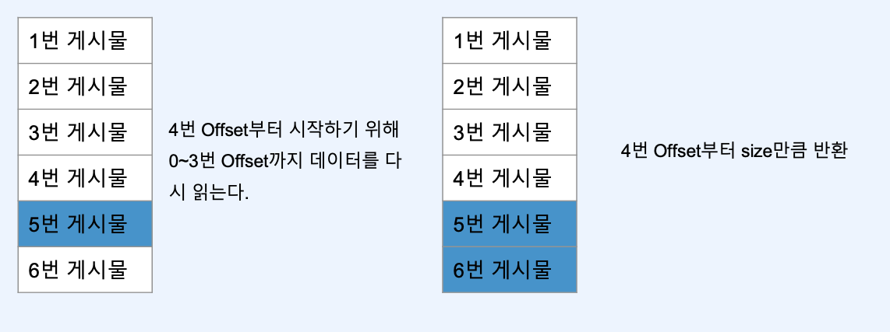
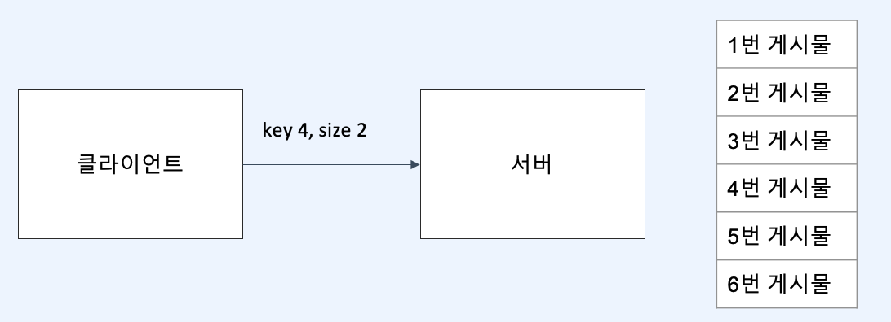

# :book: 패스트캠퍼스 백엔드 개발자를 위한 한 번에 끝내는 대용량 데이터 & 트래픽 처리
## :pushpin: Chapter 07. 페이지네이션 
- 1000개가 넘는 게시물들을 한 화면에 노출시킬 수 있을까?
- 많은 양의 데이터를 어떻게 노출시킬 것인가
- 다음 페이지 vs 스크롤


### 페이지네이션 구현


### 오프셋 기반 페이징 구현의 문제
- 마지막 페이지를 구하기 위해 전체 갯수를 알아야함

```text
String query = String.format("""
    SELECT *
    FROM %s
    WHERE memberId = :memberId
    ORDER BY %s
    LIMIT :offset, :size
    """,  TABLE, PageHelper.orderBy(sort));
```

- offset = 4, size = 2



- 불필요한 데이터 조회 발생 

- 
### 커서 기반 페이징
- 커서 기반 페이징은 키를 기준으로 데이터 탐색 범위를 최소화




- 커서 기반 페이징은 전체 데이터를 조회하지 않기 때문에 아래 UI 구현이 어려움

```text
<< < 1 2 3 4 5 6 7 8 9 10 > >>
```