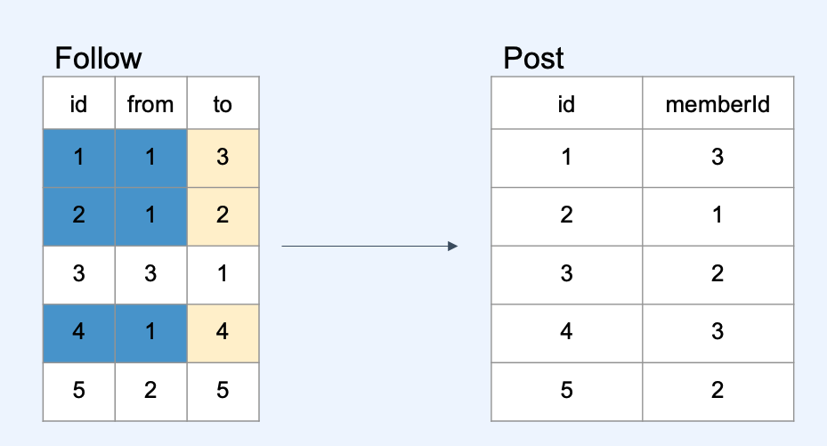

# :book: 백엔드 개발자를 위한 대용량 데이터 & 트래픽 처리
## :pushpin: Chapter 09. 타임라인 최적화

### 타임라인이란?
- `트위터`, `페이스북`, `인스타그램` 등 SNS에서 팔로워들의 게시물을 보여주는 피드

### 타임라인 요구사항
- 회원 ID를 받아, 해당 회원의 팔로워들의 게시물들을 시간순으로 조회

## 서비스가 커질수록 느려지는 타임라인
### 타임라인 구현 흐름
1. 회원의 팔로우 목록 조회
2. 1번의 팔로우 회원 id로 게시물 조회



```text
시간 복잡도
log(Follow 전체 레코드) + 해당 회원의 Following * log(Post 전체 레코드)
```

- Fan Out On Read (Pull Model)
- 사용자가 매번 홈에 접속할 때마다 부하가 발


## Fan out on write 방식의 타임라인
- Fan Out On Write (Push Model)
- 게시물 작성시, 해당 회원을 팔로우하는 회원들에게 데이터를 배달한다.

