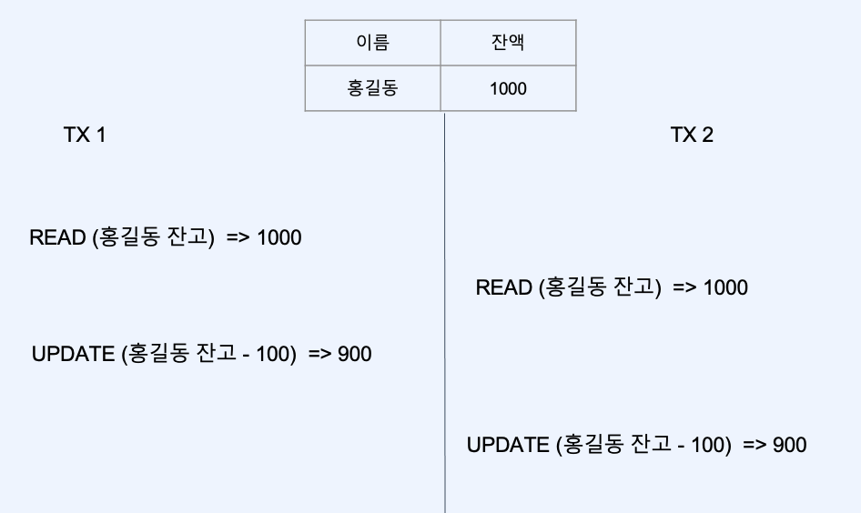
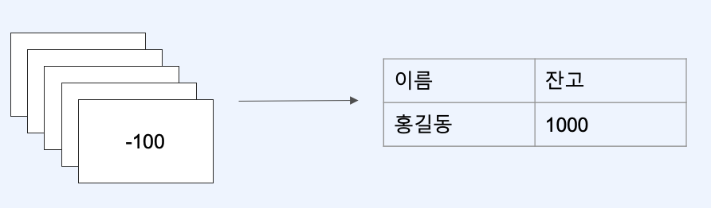

# :book: 백엔드 개발자를 위한 대용량 데이터 & 트래픽 처리
## :pushpin: Chapter 11. 동시성 제어하기
### 멀티 스레드 환경에 대한 이해

### 동시성
- 대부분 하나의 웹 서버는 여러 개의 요청을 동시에 수행할 수 있다.
- 작성한 코드 한 줄은 동시에 수행될 수 있다.
- 하나의 자원을 두고 여러 개의 연산들이 경합 -> 데이터 정합성을 깨뜨릴 수 있다.

- 100원을 출금하는 요청이 동시에 발생한다면

### 데이터베이스에서 동시성 이슈가 발생하는 일반적인 패턴
1. 공유자원 조회 

-> 다른 오퍼레이션 수행

2. 공유자원 갱신

### 공유 자원에 대한 잠금을 획득하여 줄 세우기

### 동시성 이슈가 어려운 이유
1. 로컬에서는 대부분 하나의 스레드로 테스트
2. 이슈가 발생하더라도 오류가 발생하지 않는다
3. 코드에서 잘 보이지 않는다.
4. 항상 발생하지 않고 비결정적으로 발생한다

## 작성한 코드 한 줄은 동시에 수행될 수 있다