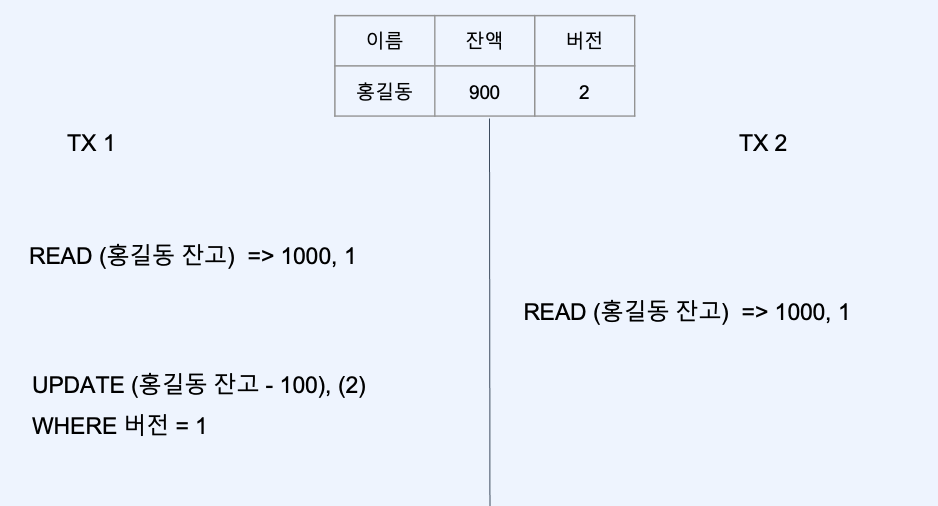
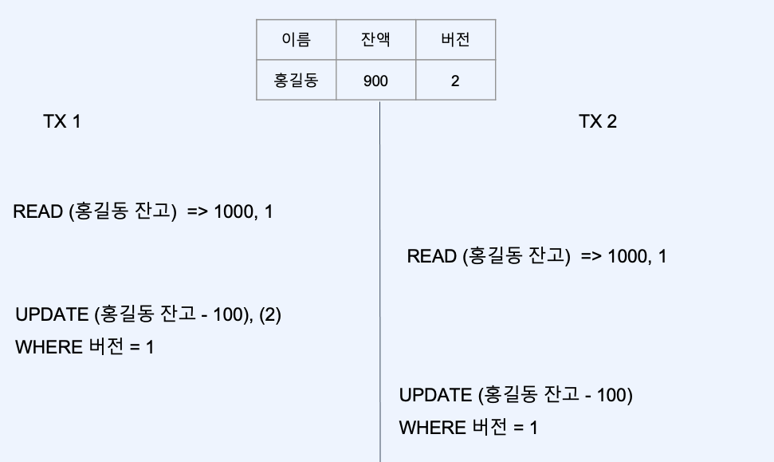

# :book: 백엔드 개발자를 위한 대용량 데이터 & 트래픽 처리
## :pushpin: Chapter 11. 동시성 제어하기

### 비관적 락
- 동시성 제어를 위한 가장 보편적인 방법은 락을 통한 줄세우기 -> 비관적 락
- 락을 통한 동시성 제어는 불필요한 대기 상태를 만듬

### 낙관적 락
- 동시성이 빈번하지 않은 쿼리로 인해 다른 쿼리가 대기한다면?
- 동시성 이슈가 빈번하지 않길 기대하고, 어플리케이션에서 제어한다.
- CAS(compare and set)을 통해 제어

- 실패에 대한 처리를 직접 구현해야함