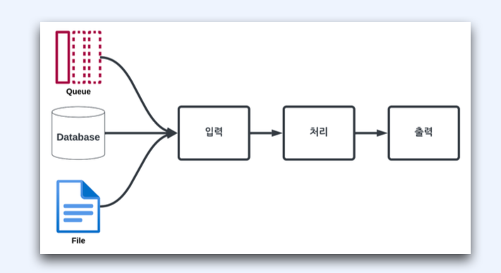

# :book: 백엔드 개발자를 위한 대용량 데이터 & 트래픽 처리
## :pushpin: 초간단 배치서비스 만들기 

### 배치 서비스란?
- 데이터를 모아서 처리
- 이벤트에 맞춰 실행된다. (트리거)
  - 스케쥴

### 배치서비스 기본 3단계
- [Read]: 많은 데이터를 데이터베이스, 파일, 메세지로부터 읽는다.
- [Processing]: 읽은 데이터를 로직에 의해 처리한다.
- [Write]: 로직으로 처리된 데이터를 수정된 형태로 출력한다.

### 배치와 우리 일상
- 주기적인 은행 업무
- 쇼핑몰 알림
- 세금 고지서 일괄 처리
- 마트의 최저가 보상 처리
- 성적 일괄 처리

### 이커머스에서의 배치
- 기획전 전시
- 쿠폰 발행
- 고객의 포인트 적립, 환불
- 등록된 상품의 이미지 처리
- 판매자 정산
- 상품 진열
- 상품 검색 인덱싱
- 홈페이지 광고나 배너 

### 배치의 특징
- UI가 없다 (별도 UI 툴 사용 가능)
- 대량의 데이터를 모아서 처리한다.
- 정해진 스케쥴에 맞춰 동작한다.
- 한번 시작하면 어떻게든 종료한다.

### 실전 Tips!
- 배치서비스는 실무에 필수
- 배치도 알림과 모니터링 필수
- 엑셀 작업 빈번함

## 배치 시스템 종류
### 배치 프로그램의 구성
- 배치 처리
  - 일련의 작업을 모아서 일괄로 처리하는 것
- 배치 스케쥴러
  - 정해진 시간에 이벤트를 발생하는 것
  - 배치가 실행되도록 트리거 역할

### 배치 처리를 위해 사용되는 도구들
- Cron, Crontab
- Quartz
- Jenkins
- 기타 트리거를 활용한 프로그램 실행
- Spring Batch

### Cron
- 스케쥴에 따라 명령어 또는 프로그램 실행을 해주는 데몬 프로세스
- 스케쥴
  - 특정 시간
  - 반복

### Crontab
- Cron 작업을 설정하는 파일
- Cron이 Crontab 파일을 읽어서 처리
- 리눅스의 스케쥴러 도구
- 시간, 날짜, 간격에 따라 주기적으로 실행
- 스케쥴 설정은 unix-cron 문자열 형식
- `* * * * * `을 사용
- `*`: 모든 값 표현
- 콤마(,): 값 목록 표현
- 대시(-): 범위 표현 

### Crontab 스케쥴 설정

|샘플 일정|크론 작업 형식|
|---|---|
|1분마다| ***** |
|매주 토요일 23:45(오후11:45)| 45 23 * * 6|
|매주 월요일 09:00(오전 9:00)| 0 9 * * 1|
|매주 일요일 04:05(오전 4:05)| 5 4 * * SUN |
|매주 평일(월~금) 22:00(오후 10:00)| 0 22 * * 1-5|

### Quartz
- Job Scheduling 라이브러리
- 기능 목록
  - Job Scheduling
  - Job Execution
  - Job Persistence
  - Transaction

### 젠킨스(Jenkins)
- 오픈소스 자동화 서버
- 빌드, 배포, 자동화에 널리 사용됨
- 스케쥴 기능을 포함하고 있음

### Spring Batch
- 액센추어 회사가 배치 처리 전문 지식을 오픈소스로 개발
- 2008년 3월말 스프링 배치 1.0.0 출시
- 자바 세계의 최초 배치 처리에 대한 표준 기반 접근
  - Job, Step, Tasklet
  - ItemReader
  - ItemProcessor
  - ItemWriter
- 현재 최신 버전은 5.0.0

### 실전 Tips!
- Cron/Crontab보다는 대안이 많음
- 젠킨스는 백엔드 필수 도구 중 하나
- 배치 작업의 메인은 Spring Batch