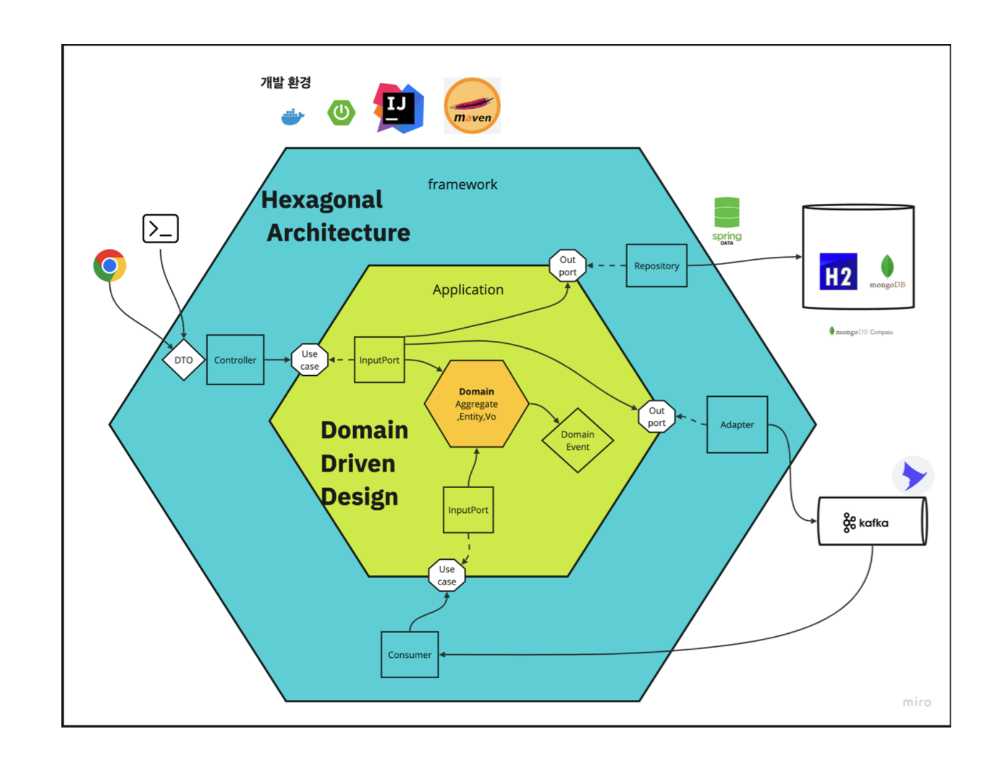

## :pushpin: EDA 기반 microservice 구현 (with Hexagonal, DDD)

### 헥사고널 아키텍처의 이해

헥사고널 아키텍처는 도메인 + 애플리케이션 + 프레임워크 헥사곤으로 구성

도메인 헥사곤
- 애그리거트(Aggregate), 엔티티(Entity), 값 객체(VO), Enum, 도메인 이벤트으로 구성
- 비즈니스 개념, 로직 구현

애플리케이션 헥사곤
- 유스케이스(I/F), 입력포트, 출력포트(I/F)로 구성
- 트랜잭션 처리, 흐름 제어, 유스케이스 구현

프레임워크 헥사곤
- 입력 어탭터(Controller), 출력 어댑터(Repository)로 구성
- 데이터 입출력, 메시지 생산(발행) / 소비 (가입)
- API 제공 
