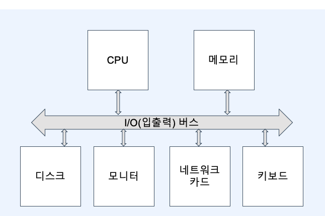

# :book: 백엔드 개발자를 위한 대용량 데이터 & 트래픽 처리

## :pushpin: Chapter 05. 조회 최적화를 위한 인덱스 이해하기
### 데이터베이스 성능 핵심

#### 컴퓨터 구조 

### 메모리 디스크 비교 
|     |메모리|디스크|
|-----|---|---|
| 속도  |빠름|느림|
|영속성|전원이 공급되지 않으면 휘발|영속성이 있음|
|가격|비쌈|저렴함|

- 데이터베이스의 데이터는 결국 `디스크`에 저장된다.
- 디스크는 메모리에 비해 훨씬 느리다.
- 결국 데이터베이스 성능에 핵심은 `디스크 I/O (접근)`을 `최소화`하는 것

### 디스크 접근은 어떻게 줄일 수 있을까?
- 메모리에 올라온 데이터로 최대한 요청을 처리하는 것
  - 메모리 캐시 히트율을 높이는 것
- 심지어 쓰기도 곧 바로 디스크에 쓰지 않고 메모리에 쓴다.
- 메모리에 데이터 유실을 고려해 WAL (Write Ahead Log)를 사용

### 데이터베이스 성능 핵심

- 대부분의 트랜잭션은 무작위하게 Write가 발생
- 이를 지연시켜 랜덤 I/O 횟수를 줄이는 대신 순차적 I/O를 발생시켜 정합성 유지
- 결국 데이터베이스 성능에 핵심은 `디스크의 랜덤 I/O (접근)을 최소화`하는 것

### 인덱스의 기본 동작
- `인덱스`는 정렬된 자료구조, 이를 통해 탐색 범위를 최소화